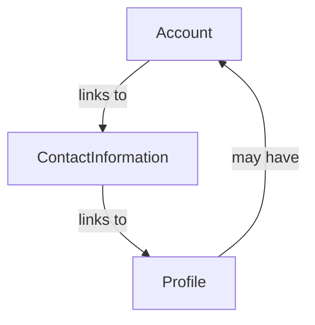

---
tags:

  - identity
  - account
  - profile
  - contact-information
  - authentication
  - domain

---

# Identity Domain

The Identity domain provides the core models and relationships for representing people, system actors, and authentication in the Tournament Organizer system. It separates business data (profiles, contact information) from authentication (accounts), enabling flexible, scalable, and privacy-conscious management of participants, staff, and other roles.

## Core Entities

- **Profile**: Represents a person or participant in the system. Stores business-relevant data (e.g., name, role,

  attributes). Not all profiles have accounts.

- **Contact Information**: Stores contact details (email, phone, address) and is linked to one or more profiles. Can be

  shared (e.g., a parent for multiple children).

- **Account**: Represents authentication credentials (username, password, provider). Linked to Contact Information (and

  thus, to Profile). Only those who need to log in have an Account.

## Relationships

- Not every Profile has an Account.
- Every Account is linked to Contact Information (and thus, at least one Profile).
- Contact Information can be shared among multiple Profiles.

## Use Cases

- **Player without Account**: A player is registered for a tournament by a coach or admin. The player has a Profile and

  Contact Information, but no Account (cannot log in).

- **Coach with Account**: A coach manages several player Profiles. The coach has an Account (can log in), Contact

  Information, and is linked to multiple Profiles (their own and their players').

- **Parent/Guardian**: A parent provides Contact Information for multiple child Profiles. Only the parent may have an

  Account.

- **Admin**: An admin has a Profile, Contact Information, and an Account with elevated permissions.

## Advantages

- **Flexibility**: Not all participants need login credentials.
- **Separation of Concerns**: Business data (Profile) is separate from authentication (Account).
- **Scalability**: Easily add new types of profiles (guest, volunteer, etc.) without requiring accounts.
- **Privacy**: Fewer accounts means less sensitive data to manage.

## Considerations

- Ensure clear documentation and diagrams for relationships.
- Define ownership and edit rights for Profiles.
- Support linking Accounts to existing Profiles when needed.
- Keep business logic (Profile) and authentication (Account) separate in code and API.

## References

- [ISO/IEC 24760-1:2019 - IT Security and Privacy — A framework for identity management](https://www.iso.org/standard/77582.html)
- [NIST Special Publication 800-63-3: Digital Identity Guidelines](https://pages.nist.gov/800-63-3/)
- [Domain-Driven Design: Tackling Complexity in the Heart of Software](https://www.amazon.com/Domain-Driven-Design-Tackling-Complexity-Software/dp/0321125215)

  by Eric Evans

## See Also

- [IDentity](../identity/identity.md)
- [Contact Information](../identity/contact_information.md)
- [Official IDentifier](../identity/official_identifier.md)
- [Account README](../identity/account/account.md)
- [Address](../identity/attributes/address.md)
- [Business README](../README.md)
