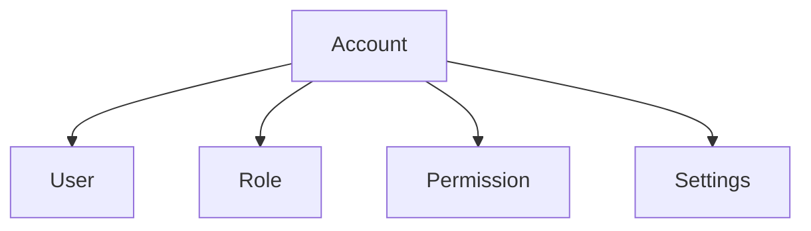

---
tags:
- identity
- account
- entity
- authentication
- domain
---

# Account (Entity)

## Overview
The Account entity represents a user account within the Tournament Organizer system. It is the central point for authentication, authorization, and user management, linking users to their roles, permissions, and settings.

## Purpose
- Enable secure authentication and authorization for users
- Manage account status, type, and access controls
- Link accounts to users, roles, permissions, and settings
- Support privacy, security, and account recovery processes

## Structure
| Attribute          | Description                                         | Type     | Required | Notes / Example                                      |
|--------------------|-----------------------------------------------------|----------|----------|------------------------------------------------------|
| **ID**             | Unique identifier for the account entity            | UUID     | Yes      | "a123e456-7890-1234-5678-901234567890"              |
| **Username**       | The username for the account                        | String   | Yes      | "john.doe", "jane_smith", "admin"                  |
| **Email**          | The email address associated with the account       | String   | Yes      | "john.doe@example.com", "jane.smith@company.com"    |
| **Password Hash**  | The hashed password for the account                 | String   | Yes      | Securely hashed password                             |
| **Status**         | The status of the account                          | String   | Optional | "Active", "Inactive", "Suspended", "Locked"         |
| **Type**           | The type of account                                | String   | Optional | "User", "Admin", "Organizer", "Participant"         |
| **Last Login**     | The timestamp of the last login                     | DateTime | Optional | "2024-01-15T10:30:00Z"                              |
| **Login Attempts** | Number of failed login attempts                     | Integer  | Optional | 0, 3, 5                                              |
| **Lockout Until**  | Timestamp until account is locked                   | DateTime | Optional | "2024-01-15T11:30:00Z"                              |
| **Settings**       | Account settings and preferences ([Setting](setting/setting.md) Value Objects) | Object   | Optional | Embedded Setting Value Objects                       |
| **Created At**     | Timestamp when the account entity was created       | DateTime | Yes      | "2024-01-15T10:30:00Z"                              |
| **Updated At**     | Timestamp when the account entity was last updated  | DateTime | Yes      | "2024-01-20T14:45:00Z"                              |

## Example

This example shows an account entity linked to user, role, permission, and settings entities.

## See Also
- [User](../profile/human.md)
- [Role](../role/role.md)
- [Permission](../role/permission/README.md)
- [Contact Information](../../identity/contact_information.md)
- [Base Entity](../../foundation/base_entity.md)
- [ISO/IEC 27001:2022 - Information security, cybersecurity and privacy protection](https://www.iso.org/standard/27001)
- [NIST SP 800-63-3: Digital Identity Guidelines](https://pages.nist.gov/800-63-3/)
- [OWASP Authentication Cheat Sheet](https://cheatsheetseries.owasp.org/cheatsheets/Authentication_Cheat_Sheet.html)
