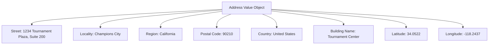

---
tags:

- identity
- attribute
- address
- value-object
- location

---

# Address (Value Object)

An **Address** is a **Value Object** representing the structured components of a physical location.
This template entity includes standard attributes from the [Base Entity](../../foundation/base_entity.md)
and is defined entirely by its attributes without its own identity or lifecycle.

Addresses are **embedded** within owning **Entities** (like profiles or organizations) to describe a specific
location associated with that Entity (e.g., mailing address, billing address, venue location).

## Purpose

Addresses provide standardized physical location representation within the identity domain, enabling consistent
handling of location data for participant registration, venue management, communication logistics, and geographic
reporting across tournament operations.

## Structure

| Attribute                | Description                                                                                 | Type   | Required | Notes / Example                                      |
| ------------------------ | ------------------------------------------------------------------------------------------- | ------ | -------- | ---------------------------------------------------- |
| **Street**               | The primary street address line(s), including house number and street name.                 | String | Yes      | Example: "123 Main St\nSuite 101", "45 B Oak Avenue" |
| **Locality**             | The city, town, or village name.                                                            | String | Yes      | Example: "Metropolis", "Smallville"                  |
| **Region**               | The state, province, or administrative region.                                              | String | Yes      | Example: "CA", "New York", "Ontario"                 |
| **Postal Code**          | The postal code (e.g., ZIP code) used for mail delivery.                                    | String | Yes      | Example: "90210", "SW1A 0AA"                         |
| **Country**              | Reference to the [Country](country.md) Entity.                                             | UUID   | Yes      | Example: `c0a1b2c3-d4e5-4f67-8901-234567abcdef`      |
| **Building Name Number** | Identifier for a specific building within a complex, if applicable.                         | String | No       | Example: "Building A", "Tower 3"                     |
| **Latitude**             | Optional geographic coordinate (latitude).                                                  | Number | Optional | Example: `40.7128`                                   |
| **Longitude**            | Optional geographic coordinate (longitude).                                                 | Number | Optional | Example: `-74.0060`                                  |

## Example

This example shows a tournament venue address with complete geographic information. The structured format enables
the tournament system to generate accurate mailing lists, provide precise directions to participants, calculate
travel distances for logistics planning, and display location information consistently across registration forms
and venue guides.

## See Also

- [Base Entity](../../foundation/base_entity.md)
- [Country](country.md)
- [Contact Information](../contact_information.md)
- [Venue](../../venue/venue.md)
- [Identity Domain](../README.md)
