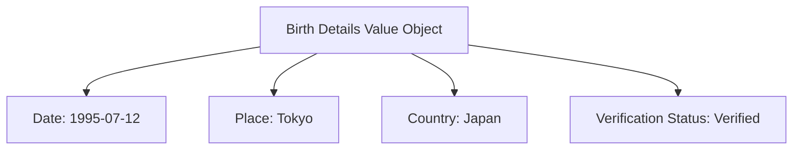

---
tags:

- identity
- attribute
- birth-details
- value-object
- verification
- eligibility

---

# Birth Details (Value Object)

A **Birth Details** Value Object aggregates information related to an individual's birth, primarily the date,
used for age calculation and eligibility checks. This template entity includes standard attributes from the
[Base Entity](../../foundation/base_entity.md) and provides comprehensive birth information for verification
and administrative purposes.

As a Value Object, it is defined entirely by its attributes without its own identity or lifecycle, and is
intended to be embedded within an owning Entity for birth record management.

## Purpose

Birth details provide comprehensive birth documentation within the identity domain, enabling age verification,
eligibility confirmation, and legal compliance for tournament participation. This supports age-restricted
competitions, nationality verification, and administrative accuracy for proper participant categorization
and record keeping.

## Structure

| Attribute               | Description                                                                                                | Type   | Required | Notes / Example                                                                   |
| ----------------------- | ---------------------------------------------------------------------------------------------------------- | ------ | -------- | --------------------------------------------------------------------------------- |
| **Date**                | The date of birth.                                                                                         | Date   | Yes      | Example: `1990-10-25`                                                             |
| **Place**               | The city, town, or locality of birth.                                                                      | String | Optional | Example: "Metropolis"                                                             |
| **Country**             | Reference to the [Country](country.md) of birth.                                                          | UUID   | Optional | Example: `c0a1b2c3-d4e5-4f67-8901-234567abcdef`                                   |
| **Verification Status** | Status indicating if the birth details have been verified against documentation.                          | String | Optional | `Verified`, `Unverified`, `Requires Verification`. Default: `Unverified`.        |

## Example

This example shows verified birth details for an international tournament participant that enable accurate age
calculation and nationality confirmation. The structured format allows tournament organizers to verify participant
eligibility for age-restricted divisions, confirm nationality for international competitions, and maintain proper
documentation compliance for regulatory requirements and fair competition standards.

## See Also

- [Base Entity](../../foundation/base_entity.md)
- [Date of Birth](date_of_birth.md)
- [Country](country.md)
- [Identity Domain](../README.md)
- [Registration](../../registration/registration.md)
