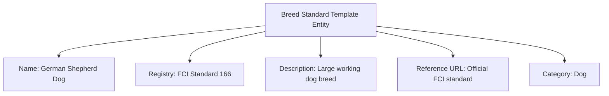

---
tags:

- identity
- attribute
- breed-standard
- template-entity
- classification
- registry

---

# Breed Standard (Template Entity)

A **Breed Standard** Template Entity represents a standardized breed standard or registry entry for a recognized
classification type. This template entity includes standard attributes from the [Base Entity](../../foundation/base_entity.md)
and provides a reference for classification characteristics, registry authority, and documentation that can be
selected and customized by users.

As a Template Entity, it possesses a unique identity and lifecycle, with additional template-specific attributes
for versioning and reuse. When used, its definition is typically copied into the target context, allowing for
potential minor modifications without altering the original template.

## Purpose

Breed standards establish official classification frameworks within the identity domain, enabling consistent
participant categorization according to recognized registries and standards. This supports specialized tournament
categories, eligibility verification for breed-specific competitions, and compliance with official breed registry
requirements.

## Structure

| Attribute         | Description                                                                    | Type         | Required | Notes / Example                                                    |
| ----------------- | ------------------------------------------------------------------------------ | ------------ | -------- | ------------------------------------------------------------------ |
| **Name**          | The official name of the breed standard template                               | String       | Yes      | `"Labrador Retriever"`, `"Shetland Pony"`                          |
| **Registry**      | The registry or authority that maintains the standard                          | String       | Yes      | `"FCI"`, `"AKC"`, `"The Kennel Club"`                              |
| **Description**   | Description of the breed standard template                                     | Text         | Yes      | `"Medium-sized, athletic, friendly temperament"`                   |
| **Reference URL** | Link to the official standard or documentation                                 | String       | No       | `"https://www.akc.org/dog-breeds/labrador-retriever/"` |
| **Category**      | Classification category for this breed standard                                | String       | Yes      | `"Dog"`, `"Horse"`, `"Cat"`, `"Bird"`                              |

## Example

This example shows a breed standard template for dog show competitions that ensures participants meet official
registry requirements. The structured framework enables tournament organizers to verify breed eligibility for
specialized categories, maintain compliance with international registry standards, and provide participants with
clear classification guidelines for breed-specific tournament divisions.

## See Also

- [Base Entity](../../foundation/base_entity.md)
- [Classification](../../classification/README.md)
- [Identity Domain](../README.md)
- [Registration](../../registration/registration.md)
- [Animal Profile](../profile/animal.md)
