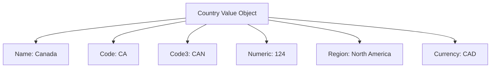

---
tags:

- identity
- attribute
- country
- value-object
- location
- iso-standard

---

# Country (Value Object)

A **Country** Value Object represents a country or nation in a standardized format. This template entity
includes standard attributes from the [Base Entity](../../foundation/base_entity.md) and provides a consistent
way to handle country information across the tournament system, including country codes, names, and related metadata.

As a Value Object, it describes characteristics of a country and is typically embedded within other entities
(like [Address](address.md) or [Contact Information](../contact_information.md)) to specify location details.

## Purpose

Countries provide standardized geographic identification within the identity domain, enabling consistent location
handling for international tournament participation, regulatory compliance, and geographic reporting. This supports
proper nationality tracking, regional competition organization, and international federation requirements.

## Structure

| Attribute    | Description                                   | Type    | Required | Notes / Example                                   |
| ------------ | --------------------------------------------- | ------- | -------- | ------------------------------------------------- |
| **Name**     | The full name of the country.                 | String  | Yes      | `"United States"`, `"Canada"`, `"United Kingdom"` |
| **Code**     | The ISO 3166-1 alpha-2 country code.          | String  | Yes      | `"US"`, `"CA"`, `"GB"`                            |
| **Code3**    | The ISO 3166-1 alpha-3 country code.          | String  | Optional | `"USA"`, `"CAN"`, `"GBR"`                         |
| **Numeric**  | The ISO 3166-1 numeric country code.          | Integer | Optional | `840`, `124`, `826`                               |
| **Region**   | The geographic region the country belongs to. | String  | Optional | `"North America"`, `"Europe"`, `"Asia"`           |
| **Currency** | The primary currency code for the country.    | String  | Optional | `"USD"`, `"CAD"`, `"GBP"`                         |

## Example

This example shows a country configuration for Canadian tournament participants. The standardized format enables
the tournament system to properly handle international registrations, apply region-specific rules for competition
organization, process payments in appropriate currencies, and generate accurate participant reports that comply
with international tournament federation requirements.

## See Also

- [Base Entity](../../foundation/base_entity.md)
- [Address](address.md)
- [Contact Information](../contact_information.md)
- [Identity Domain](../README.md)
- [Registration](../../registration/registration.md)
