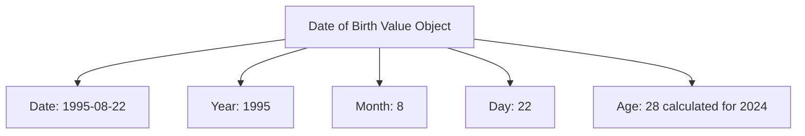

---
tags:

- identity
- attribute
- date-of-birth
- value-object
- age

---

# Date of Birth (Value Object)

A **Date of Birth** Value Object represents an individual's birth date in a standardized format.
This template entity includes standard attributes from the [Base Entity](../../foundation/base_entity.md)
and provides a consistent way to handle birth date information for age calculations, eligibility verification,
and administrative purposes within the tournament system.

As a Value Object, it describes temporal characteristics and is typically embedded within other entities
to specify birth details.

## Purpose

Date of Birth serves as a fundamental temporal identifier within the identity domain, enabling age-based
eligibility verification, category classification, and compliance with age-restricted tournament regulations.
This supports fair competition grouping and legal compliance for youth protection requirements.

## Structure

| Attribute | Description                            | Type    | Required | Notes / Example                |
| --------- | -------------------------------------- | ------- | -------- | ------------------------------ |
| **Date**  | The birth date in ISO 8601 format.     | Date    | Yes      | `"1990-05-15"`, `"2005-12-03"` |
| **Year**  | The birth year.                        | Integer | Optional | `1990`, `2005`                 |
| **Month** | The birth month (1-12).                | Integer | Optional | `5`, `12`                      |
| **Day**   | The birth day (1-31).                  | Integer | Optional | `15`, `3`                      |
| **Age**   | Calculated age as of a reference date. | Integer | Optional | `33`, `18`                     |

## Example

This example shows a tournament participant's birth date that enables automatic age calculation for category
placement. The structured format allows the tournament system to verify eligibility for age-restricted divisions,
calculate current age dynamically for ongoing tournaments, and ensure compliance with youth protection policies
while maintaining privacy through secure data handling.

## See Also

- [Base Entity](../../foundation/base_entity.md)
- [Registration](../../registration/registration.md)
- [Identity Domain](../README.md)
- [Age Verification](../age_verification.md)
