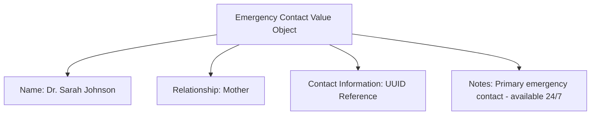

---
tags:

- identity
- attribute
- emergency-contact
- value-object
- safety
- contact

---

# Emergency Contact (Value Object)

An **Emergency Contact** is a **Value Object** representing the details of a person designated to be contacted
in case of an emergency involving the owner of the parent record. This template entity includes standard attributes
from the [Base Entity](../../foundation/base_entity.md) and is defined entirely by its attributes without its own
identity or lifecycle.

Emergency contacts are always **embedded** within an owning entity to provide critical safety information during
tournament operations.

## Purpose

Emergency contacts provide essential safety infrastructure within the identity domain, enabling rapid response
during medical emergencies, accidents, or safety incidents at tournament venues. This supports duty of care
obligations, participant safety protocols, and emergency response coordination requirements.

## Structure

| Attribute                   | Description                                                                                                                | Type   | Required | Notes / Example                                                                  |
| --------------------------- | -------------------------------------------------------------------------------------------------------------------------- | ------ | -------- | -------------------------------------------------------------------------------- |
| **Name**                    | The full name of the emergency contact person.                                                                             | String | Yes      | Example: "Jane Doe"                                                              |
| **Relationship To Subject** | The relationship of the emergency contact to the subject person.                                                          | String | Yes      | Example: `"Parent"`, `"Spouse"`, `"Friend"`, `"Guardian"`                        |
| **Contact Information**     | Reference to the Contact Information entity containing phone and email details.                                            | UUID   | Yes      |                                                                                  |
| **Notes**                   | Optional instructions or notes regarding contacting this person.                                                           | Text   | Optional | Example: `"Primary contact, call anytime."`, `"If no answer, try mobile first."` |

## Example

This example shows an emergency contact for a youth tournament participant. The structured format enables tournament
staff to quickly identify and reach the appropriate person during emergencies, understand the relationship context
for informed communication, and follow specific contact preferences to ensure effective emergency response while
maintaining participant safety protocols.

## See Also

- [Base Entity](../../foundation/base_entity.md)
- [Contact Information](../contact_information.md)
- [Identity Domain](../README.md)
- [Safety](../../safety/README.md)
- [Registration](../../registration/registration.md)
