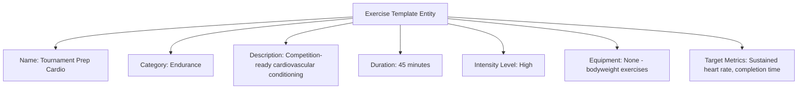

---
tags:

- identity
- attribute
- exercise
- template-entity
- fitness
- activity

---

# Exercise (Template Entity)

An **Exercise** Template Entity defines a reusable blueprint for physical exercise activities that can be assigned
to participants. This template entity includes standard attributes from the [Base Entity](../../foundation/base_entity.md)
and provides a standardized structure for exercise content, requirements, and performance metrics that can be applied
across different fitness and training contexts.

As a Template Entity, it possesses a unique identity and lifecycle, with additional template-specific attributes
for versioning and reuse across fitness programs and performance monitoring processes.

## Purpose

Exercise templates establish structured fitness frameworks within the identity domain, enabling consistent physical
preparation, performance tracking, and health maintenance for tournament participants. This supports conditioning
programs, injury prevention protocols, and standardized fitness assessment criteria across different athletic
disciplines and competition levels.

## Structure

| Attribute           | Description                                                                          | Type         | Required | Notes / Example                                                   |
| ------------------- | ------------------------------------------------------------------------------------ | ------------ | -------- | ----------------------------------------------------------------- |
| **Name**            | The name of the exercise template.                                                   | String       | Yes      | `"Cardio Conditioning"`, `"Strength Training"`                   |
| **Category**        | The category of exercise.                                                            | String       | Yes      | `"Cardio"`, `"Strength"`, `"Flexibility"`, `"Endurance"`         |
| **Description**     | Description of the exercise template and its objectives.                            | Text         | Yes      | `"High-intensity cardiovascular conditioning program"`            |
| **Duration**        | Standard duration for this exercise in minutes.                                     | Integer      | Optional | `30` for short session, `60` for full workout                    |
| **Intensity Level** | The intensity level of the exercise.                                                | String       | Optional | `"Low"`, `"Moderate"`, `"High"`, `"Variable"`                    |
| **Equipment**       | List of equipment needed for this exercise.                                         | List[String] | Optional | `["Treadmill", "Weights", "Mat"]`                                |
| **Prerequisites**   | List of prerequisites for this exercise template.                                   | List[String] | Optional | `["Basic fitness level", "Medical clearance"]`                   |
| **Target Metrics**  | List of target performance metrics for this exercise.                               | List[String] | Optional | `["Heart rate 140-160 bpm", "Duration 30 minutes"]`              |

## Example

This example shows an endurance exercise template designed for tournament preparation that builds cardiovascular
fitness without equipment requirements. The structured framework enables coaches to assign consistent conditioning
programs, track participant progress toward competition readiness, and ensure proper physical preparation standards
across different training environments and participant fitness levels.

## See Also

- [Base Entity](../../foundation/base_entity.md)
- [Exercise Regimen](exercise_regimen.md)
- [Training](training.md)
- [Identity Domain](../README.md)
- [Physical](physical.md)
