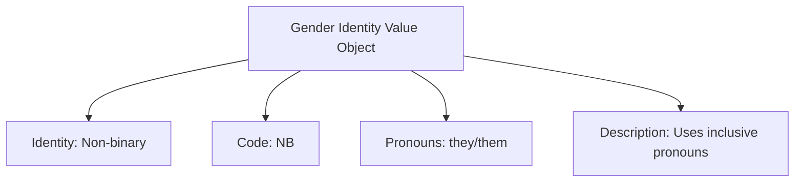

---
tags:

- identity
- attribute
- gender-identity
- value-object
- inclusion
- diversity

---

# Gender Identity (Value Object)

A **Gender Identity** Value Object represents an individual's personal sense of their gender in a standardized format.
This template entity includes standard attributes from the [Base Entity](../../foundation/base_entity.md) and provides
a consistent way to handle gender identity information for respectful and inclusive interactions within the
tournament system.

As a Value Object, it describes personal characteristics and is typically embedded within other entities
to specify gender identity details with appropriate privacy and respect.

## Purpose

Gender identity provides inclusive identification frameworks within the identity domain, enabling respectful
participant registration, appropriate facility accommodations, and inclusive communication practices.
This supports diversity and inclusion requirements, anti-discrimination policies, and respectful tournament
environment standards.

## Structure

| Attribute       | Description                                                  | Type   | Required | Notes / Example                                     |
| --------------- | ------------------------------------------------------------ | ------ | -------- | --------------------------------------------------- |
| **Identity**    | The gender identity category.                                | String | Yes      | `"Man"`, `"Woman"`, `"Non-binary"`, `"Genderfluid"` |
| **Code**        | A standardized code for the gender identity.                 | String | Optional | `"M"`, `"W"`, `"NB"`, `"GF"`                        |
| **Pronouns**    | Preferred pronouns for the individual.                       | String | Optional | `"he/him"`, `"she/her"`, `"they/them"`              |
| **Description** | Additional description or context about the gender identity. | String | Optional | `"Identifies as a transgender woman"`               |

## Example

This example shows a non-binary gender identity configuration that enables respectful communication and inclusive
tournament policies. The structured format allows tournament staff to use appropriate pronouns in announcements,
ensure inclusive facility arrangements, and maintain respectful participant interactions while supporting diversity
and inclusion objectives throughout tournament operations.

## See Also

- [Base Entity](../../foundation/base_entity.md)
- [Human Profile](../profile/human.md)
- [Identity Domain](../README.md)
- [Registration](../../registration/README.md)
- [Code of Conduct](../../code_of_conduct/README.md)
