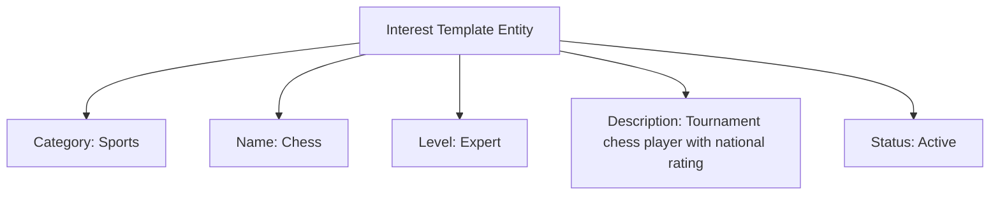

---
tags:

- identity
- attribute
- interest
- template-entity
- hobby
- matching

---

# Interest (Template Entity)

An **Interest** Template Entity represents a standardized interest category or hobby that can be selected and
customized by users. This template entity includes standard attributes from the [Base Entity](../../foundation/base_entity.md)
and provides a consistent way to handle interest information for participant matching, team formation, and
personalization within the tournament system.

As a Template Entity, it possesses a unique identity and lifecycle, with additional template-specific attributes
for versioning and reuse. When used, its definition is typically copied into the target context, allowing for
potential minor modifications without altering the original template.

## Purpose

Interests establish connection and matching frameworks within the identity domain, enabling participant networking,
team formation based on shared interests, and enhanced tournament experiences through common ground identification.
This supports social engagement, partnership building, and community development within tournament environments.

## Structure

| Attribute       | Description                                           | Type     | Required | Notes / Example                                                   |
| --------------- | ----------------------------------------------------- | -------- | -------- | ----------------------------------------------------------------- |
| **Category**    | The category of interest.                             | String   | Yes      | `"Sports"`, `"Technology"`, `"Arts"`, `"Science"`                 |
| **Name**        | The specific name of the interest.                    | String   | Yes      | `"Basketball"`, `"Programming"`, `"Painting"`, `"Physics"`        |
| **Level**       | The level of expertise or involvement.                | String   | Optional | `"Beginner"`, `"Intermediate"`, `"Expert"`                        |
| **Description** | Additional description or context about the interest. | String   | Optional | `"Competitive basketball player"`, `"Web development enthusiast"` |
| **Status**      | The status of the interest template.                  | String   | Optional | `"Active"`, `"Inactive"`, `"Deprecated"`                          |

## Example

This example shows a chess interest template that enables strategic tournament organization and participant matching.
The structured framework allows organizers to group participants with similar interests for social events, identify
potential coaching relationships between experts and beginners, and create more engaging tournament experiences
by connecting people with shared passions beyond the primary competition.

## See Also

- [Base Entity](../../foundation/base_entity.md)
- [Identity Domain](../README.md)
- [Team](../../team/README.md)
- [Registration](../../registration/registration.md)
- [Communication](../../communication/README.md)
