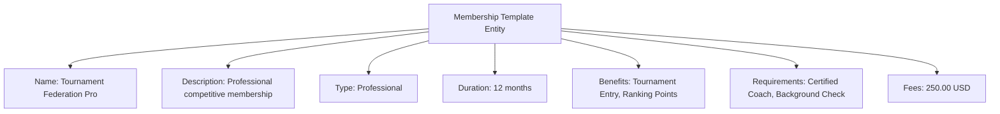

---
tags:

- identity
- attribute
- membership
- template-entity
- affiliation
- organization

---

# Membership (Template Entity)

A **Membership** Template Entity defines a reusable blueprint for formal affiliation status types that can be
offered by organizations. This template entity includes standard attributes from the [Base Entity](../../foundation/base_entity.md)
and provides a standardized structure for membership types, benefits, and requirements that can be applied across
different organizations and contexts.

As a Template Entity, it possesses a unique identity and lifecycle, with additional template-specific attributes
for versioning and reuse across tournament registration and participant management processes.

## Purpose

Membership templates establish standardized affiliation frameworks within the identity domain, enabling consistent
management of organizational relationships, access privileges, and participant eligibility. This supports federation
membership requirements, tournament entry qualifications, and structured benefit distribution across different
membership tiers and organizations.

## Structure

| Attribute        | Description                                                                    | Type    | Required | Notes / Example                               |
| ---------------- | ------------------------------------------------------------------------------ | ------- | -------- | --------------------------------------------- |
| **Name**         | The name of the membership template.                                          | String  | Yes      | `"Professional Membership"`, `"Student Membership"` |
| **Description**  | Description of the membership template and its benefits.                      | Text    | Yes      | `"Full access to all facilities and events"` |
| **Type**         | The type of membership template.                                              | String  | Yes      | `"Professional"`, `"Student"`, `"Lifetime"`  |
| **Duration**     | Standard duration for this membership type in months.                        | Integer | Optional | `12` for annual, `6` for semi-annual          |
| **Benefits**     | List of benefits provided by this membership template.                       | List    | Optional | `["Facility Access", "Event Discounts"]`     |
| **Requirements** | List of requirements for this membership template.                           | List    | Optional | `["Age 18+", "Professional Certification"]`  |
| **Fees**         | Standard fees for this membership template.                                  | Decimal | Optional | `100.00`, `50.00`                            |
| **Currency**     | The currency for the membership fees.                                        | String  | Optional | `"USD"`, `"EUR"`                             |

## Example

This example shows a professional tournament federation membership template that provides tournament entry privileges
and ranking eligibility. The structured framework enables organizations to maintain consistent membership standards,
automatically verify participant eligibility for tournaments, and ensure proper federation compliance for competitive
events across different venues and regions.

## See Also

- [Base Entity](../../foundation/base_entity.md)
- [Identity Domain](../README.md)
- [Organization](../../organization/README.md)
- [Registration](../../registration/registration.md)
- [Finance](../../finance/README.md)
