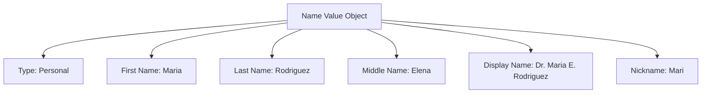

---
tags:

- identity
- attribute
- name
- value-object

---

# Name (Value Object)

A **Name** Value Object represents a person's or entity's name in a structured format. This template entity
includes standard attributes from the [Base Entity](../../foundation/base_entity.md) and provides a standardized way
to handle different types of names (personal names, business names, etc.) with appropriate components and formatting.

As a Value Object, it does not have identity or lifecycle - it is immutable and defined by its attributes, and is
typically embedded within other entities to specify identification details.

## Purpose

Names serve as fundamental identification elements within the identity domain, providing structured representation
of how individuals, organizations, or entities are identified and addressed. This enables consistent name handling
across tournament registration, communication, and record-keeping processes.

## Structure

| Attribute         | Description                                    | Type   | Required | Notes / Example                              |
| ----------------- | ---------------------------------------------- | ------ | -------- | -------------------------------------------- |
| **Type**          | The type of name (personal, business, etc.).   | String | Yes      | `"Personal"`, `"Business"`, `"Display"`      |
| **First Name**    | The first or given name (for personal names).  | String | Optional | `"John"`, `"Maria"`                          |
| **Last Name**     | The last name or surname (for personal names). | String | Optional | `"Smith"`, `"Garcia"`                        |
| **Middle Name**   | The middle name (for personal names).          | String | Optional | `"Robert"`, `"Elizabeth"`                    |
| **Business Name** | The business or organization name.             | String | Optional | `"Acme Corporation"`, `"Smith & Associates"` |
| **Display Name**  | A formatted display version of the name.       | String | Optional | `"John R. Smith"`, `"Dr. Maria Garcia"`      |
| **Nickname**      | A nickname or preferred name.                  | String | Optional | `"Johnny"`, `"Mari"`                         |

## Example

This example shows a personal name for a tournament organizer who prefers to be addressed formally as
"Dr. Maria E. Rodriguez" in official communications but uses "Mari" in casual settings. The structured format
enables the tournament system to generate appropriate name displays for registration forms, certificates,
and announcements while respecting personal preferences for different contexts.

## See Also

- [Base Entity](../../foundation/base_entity.md)
- [Identity Domain](../../identity/README.md)
- [Contact Information](../../identity/contact_information.md)
