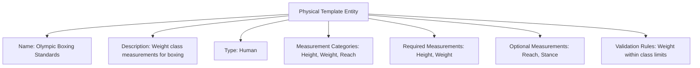

---
tags:

- identity
- attribute
- physical
- template-entity
- measurement
- characteristics

---

# Physical (Template Entity)

A **Physical** Template Entity defines a reusable blueprint for physical measurement categories and standards
that can be applied to profiles (human, animal, or plant). This template entity includes standard attributes
from the [Base Entity](../../foundation/base_entity.md) and provides a standardized framework for defining
what physical measurements are relevant for different profile types and contexts.

As a Template Entity, it possesses a unique identity and lifecycle, with additional template-specific attributes
for versioning and reuse across tournament registration and eligibility verification processes.

## Purpose

Physical templates establish standardized measurement frameworks within the identity domain, enabling consistent
collection of physical characteristics for eligibility verification, safety requirements, and category classification.
This supports sports-specific requirements, accessibility accommodations, and fair competition grouping based on
physical attributes.

## Structure

| Attribute               | Description                                              | Type         | Required | Notes / Example                                    |
| ----------------------- | -------------------------------------------------------- | ------------ | -------- | -------------------------------------------------- |
| **Name**                | The name of the physical measurement template.          | String       | Yes      | `"Human Adult Measurements"`, `"Dog Breed Standards"` |
| **Description**         | Description of the physical measurement template.       | Text         | Yes      | `"Standard measurements for adult human participants"` |
| **Type**                | The type of profile this template applies to.           | String       | Yes      | `"Human"`, `"Animal"`, `"Plant"`                   |
| **Measurement Categories** | List of measurement categories for this template.    | List[String] | Yes      | `["Height", "Weight", "Build"]`                    |
| **Required Measurements** | List of required measurements for this template.      | List[String] | Optional | `["Height", "Weight"]`                             |
| **Optional Measurements** | List of optional measurements for this template.      | List[String] | Optional | `["Build", "Wingspan"]`                            |
| **Validation Rules**    | Rules for validating measurements in this template.     | List[String] | Optional | `["Height must be positive", "Weight reasonable"]` |

## Example

This example shows a physical measurement template for boxing tournaments that ensures participants meet weight
class requirements and safety standards. The structured framework enables tournament organizers to collect
standardized measurements, validate eligibility for specific divisions, and maintain consistent data quality
across different tournament events and venues.

## See Also

- [Base Entity](../../foundation/base_entity.md)
- [Identity Domain](../README.md)
- [Registration](../../registration/registration.md)
- [Classification](../../classification/README.md)
- [Safety](../../safety/README.md)
