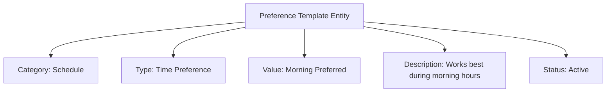

---
tags:

- identity
- attribute
- preference
- template-entity
- personalization
- user-experience

---

# Preference (Template Entity)

A **Preference** Template Entity represents a standardized preference category that can be selected and customized
by users. This template entity includes standard attributes from the [Base Entity](../../foundation/base_entity.md)
and provides a consistent way to handle preference information for personalization, team formation, and user
experience within the tournament system.

As a Template Entity, it possesses a unique identity and lifecycle, with additional template-specific attributes
for versioning and reuse. When used, its definition is typically copied into the target context, allowing for
potential minor modifications without altering the original template.

## Purpose

Preferences establish personalized experience frameworks within the identity domain, enabling customized tournament
participation based on individual needs, accessibility requirements, and personal choices. This supports inclusive
tournament design, participant satisfaction, and operational efficiency through better matching and scheduling.

## Structure

| Attribute       | Description                                             | Type     | Required | Notes / Example                                                  |
| --------------- | ------------------------------------------------------- | -------- | -------- | ---------------------------------------------------------------- |
| **Category**    | The category of preference.                             | String   | Yes      | `"Communication"`, `"Schedule"`, `"Team Size"`, `"Location"`     |
| **Type**        | The specific type of preference.                        | String   | Yes      | `"Email"`, `"Morning"`, `"Small Teams"`, `"Indoor"`              |
| **Value**       | The preference value or setting.                        | String   | Optional | `"Preferred"`, `"Avoid"`, `"Required"`                           |
| **Description** | Additional description or context about the preference. | String   | Optional | `"Prefers morning training sessions"`, `"Avoids outdoor venues"` |
| **Status**      | The status of the preference template.                  | String   | Optional | `"Active"`, `"Inactive"`, `"Deprecated"`                         |

## Example

This example shows a scheduling preference template that enables participant accommodation for optimal performance
times. The structured framework allows tournament organizers to collect preference data during registration,
optimize scheduling for participant satisfaction, and create more inclusive tournament experiences by respecting
individual needs and accessibility requirements.

## See Also

- [Base Entity](../../foundation/base_entity.md)
- [Identity Domain](../README.md)
- [Schedule](../../schedule/README.md)
- [Registration](../../registration/registration.md)
- [Team](../../team/README.md)
