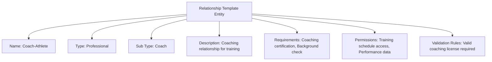

---
tags:

- identity
- attribute
- relationship
- template-entity
- connection
- permissions

---

# Relationship (Template Entity)

A **Relationship** Template Entity defines a reusable blueprint for relationship types and configurations that can be
used to create specific relationship instances. This template entity includes standard attributes from the
[Base Entity](../../foundation/base_entity.md) and provides a standardized framework for relationship categories,
types, and requirements that can be applied across different contexts and profiles.

As a Template Entity, it possesses a unique identity and lifecycle, with additional template-specific attributes
for versioning and reuse across participant management and organizational structure processes.

## Purpose

Relationships establish structured connection frameworks within the identity domain, enabling proper authority
delegation, emergency contact protocols, and participant support systems. This supports guardian relationships
for minors, coaching connections, team hierarchies, and organizational structures necessary for comprehensive
tournament participant management and safety protocols.

## Structure

| Attribute            | Description                                                                                                     | Type         | Required | Notes / Example                                                       |
| -------------------- | --------------------------------------------------------------------------------------------------------------- | ------------ | -------- | --------------------------------------------------------------------- |
| **Name**             | The name of the relationship template.                                                                         | String       | Yes      | `"Parent-Child"`, `"Owner-Pet"`, `"Coach-Athlete"`                    |
| **Type**             | Broad classification of the relationship template.                                                             | String       | Yes      | Example: "Familial", "Ownership", "Professional"                      |
| **Sub Type**         | Specific nature of the relationship template.                                                                  | String       | Yes      | Example: "Parent", "Child", "Owner", "Guardian", "Coach"             |
| **Description**      | Description of the relationship template and its characteristics.                                              | String       | No       | "Standard parent-child relationship template"                         |
| **Requirements**     | Standard requirements for this relationship template.                                                          | List[String] | Optional | `["Legal documentation", "Age verification"]`                        |
| **Permissions**      | Standard permissions granted by this relationship template.                                                    | List[String] | Optional | `["Medical decisions", "Tournament registration"]`                   |
| **Validation Rules** | Rules for validating this relationship template.                                                              | List[String] | Optional | `["Both parties must be registered", "Age requirements met"]`         |

## Example

This example shows a coach-athlete relationship template that establishes proper authority structures for training
and tournament participation. The structured framework enables tournament organizers to verify coaching credentials,
manage training access permissions, and maintain appropriate professional boundaries while ensuring participant
safety and proper supervision during tournament preparation and competition events.

## See Also

- [Base Entity](../../foundation/base_entity.md)
- [Emergency Contact](emergency_contact.md)
- [Identity Domain](../README.md)
- [Team](../../team/README.md)
- [Organization](../../organization/README.md)
