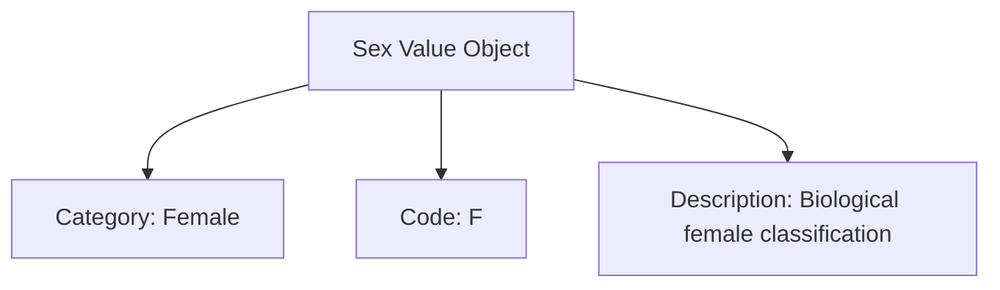

---
tags:

- identity
- attribute
- sex
- value-object
- biological
- classification

---

# Sex (Value Object)

A **Sex** Value Object represents biological sex classification in a standardized format. This template entity
includes standard attributes from the [Base Entity](../../foundation/base_entity.md) and provides a consistent
way to handle sex information for medical, legal, and administrative purposes within the tournament system.

As a Value Object, it describes biological characteristics and is typically embedded within other entities
to specify biological details for appropriate record-keeping and regulatory compliance.

## Purpose

Sex classification provides essential biological identification within the identity domain, enabling appropriate
medical care coordination, legal compliance with sporting regulations, and administrative record accuracy.
This supports gender-specific competition categories, medical emergency response, and regulatory compliance
requirements for various tournament types.

## Structure

| Attribute       | Description                                                     | Type   | Required | Notes / Example                              |
| --------------- | --------------------------------------------------------------- | ------ | -------- | -------------------------------------------- |
| **Category**    | The biological sex category.                                    | String | Yes      | `"Male"`, `"Female"`, `"Intersex"`           |
| **Code**        | A standardized code for the sex category.                       | String | Optional | `"M"`, `"F"`, `"I"`                          |
| **Description** | Additional description or context about the sex classification. | String | Optional | `"Biological male"`, `"Intersex individual"` |

## Example

This example shows a biological sex classification that enables appropriate tournament category placement and
medical record keeping. The structured format allows tournament organizers to comply with sporting federation
rules for gender-specific competitions, ensure proper medical emergency response protocols, and maintain
accurate administrative records while respecting privacy and regulatory requirements.

## See Also

- [Base Entity](../../foundation/base_entity.md)
- [Gender Identity](gender_identity.md)
- [Medical History](medical_history/medical_history.md)
- [Human Profile](../profile/human.md)
- [Identity Domain](../README.md)
