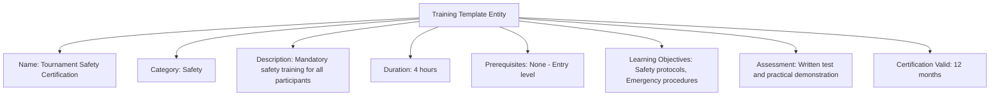

---
tags:

- identity
- attribute
- training
- template-entity
- skill-development
- performance

---

# Training (Template Entity)

A **Training** Template Entity defines a reusable blueprint for training sessions, activities, or programs that can be
offered to participants. This template entity includes standard attributes from the [Base Entity](../../foundation/base_entity.md)
and provides a standardized structure for training content, requirements, and assessment criteria that can be applied
across different contexts and organizations.

As a Template Entity, it possesses a unique identity and lifecycle, with additional template-specific attributes
for versioning and reuse across skill development and performance improvement processes.

## Purpose

Training templates establish structured development frameworks within the identity domain, enabling consistent
skill building, performance tracking, and certification preparation for tournament participants. This supports
coaching programs, safety training requirements, competitive skill development, and standardized assessment
criteria across different training contexts and organizations.

## Structure

| Attribute                | Description                                                                                | Type         | Required | Notes / Example                                                                                                    |
| ------------------------ | ------------------------------------------------------------------------------------------ | ------------ | -------- | ------------------------------------------------------------------------------------------------------------------ |
| **Name**                 | The name of the training template.                                                        | String       | Yes      | `"Basic Safety Training"`, `"Advanced Techniques"`                                                                |
| **Category**             | The category of training.                                                                  | String       | Yes      | `"Safety"`, `"Skills"`, `"Physical"`, `"Mental"`                                                                  |
| **Description**          | Description of the training template and its objectives.                                  | Text         | Yes      | `"Comprehensive safety training for tournament participants"`                                                      |
| **Duration**             | Standard duration for this training in hours.                                            | Integer      | Optional | `8` for full day, `2` for short session                                                                           |
| **Prerequisites**        | List of prerequisites for this training template.                                        | List[String] | Optional | `["Basic knowledge", "Prior experience", "Age 16+"]`                                                              |
| **Learning Objectives**  | List of learning objectives for this training template.                                  | List[String] | Optional | `["Understand safety protocols", "Demonstrate proper technique"]`                                                  |
| **Assessment Criteria**  | Criteria for assessing completion of this training.                                      | List[String] | Optional | `["Written test 80%+", "Practical demonstration", "Instructor approval"]`                                         |
| **Certification Valid** | How long the certification from this training is valid (in months).                      | Integer      | Optional | `12` for annual renewal, `24` for biennial                                                                        |

## Example

This example shows a safety training template that ensures all tournament participants meet basic safety requirements.
The structured framework enables tournament organizers to maintain consistent safety standards, track participant
training completion, verify current certifications, and ensure compliance with safety regulations across different
venues and competition types.

## See Also

- [Base Entity](../../foundation/base_entity.md)
- [Identity Domain](../README.md)
- [Safety](../../safety/README.md)
- [Organization](../../organization/README.md)
- [Registration](../../registration/registration.md)
