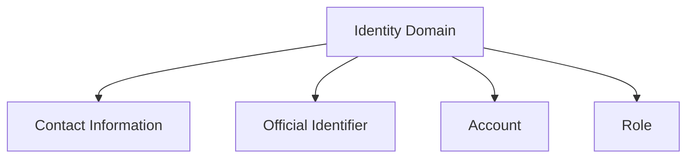

---
tags:
- identity
- domain
---

# Identity Domain

## Overview

The Identity Domain defines the core concepts, entities, and relationships for representing identities within the Tournament Organizer system. It provides a foundation for managing individuals, organizations, and their associated identifiers, accounts, and roles.

## Purpose

- Centralize identity management for all system participants
- Enable secure and privacy-compliant identification
- Support linking of contact information, official identifiers, accounts, and roles
- Facilitate integration with authentication and authorization mechanisms

## Structure

The Identity Domain includes the following core entities and value objects:

- [Contact Information](contact_information.md): Template entity for managing contact details
- [Official Identifier](official_identifier.md): Value object for official identification numbers
- [Account](account/account.md): Entity for user authentication and management
- [Role](role/README.md): Entity for role-based access and responsibilities

## Example

This diagram shows the main entities and their relationships within the Identity Domain.

## See Also

- [ISO/IEC 24760-1:2019 - IT Security and Privacy — A framework for identity management](https://www.iso.org/standard/77582.html)
- [Identity README](README.md)
- [Contact Information](contact_information.md)
- [Official Identifier](official_identifier.md)
- [Account](account/account.md)
- [Role](role/README.md)
- [Business Domain](../README.md)
