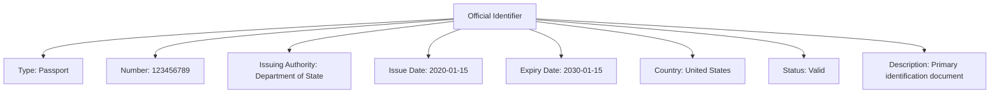

---
tags:

  - identity
  - official-identifier
  - value-object
  - domain

---

# Official Identifier (Value Object)

## Overview

The Official Identifier value object represents formal identification numbers or codes issued by recognized authorities. It is used to verify the identity of individuals or organizations within the Tournament Organizer system.

## Purpose

- Provide a standardized way to store and validate official identification
- Support compliance with legal and privacy requirements
- Enable verification for registration and participation

## Structure

| Attribute             | Description                                             | Type   | Required | Notes / Example                                                               |
|-----------------------|---------------------------------------------------------|--------|----------|-------------------------------------------------------------------------------|
| **Type**              | The type of official identifier                        | String | Yes      | "Passport", "Driver's License", "Social Security", "Business License"         |
| **Number**            | The official identification number                     | String | Yes      | "123456789", "ABC123456", "SSN-123-45-6789"                                   |
| **Issuing Authority** | The authority that issued the identifier               | String | Optional | "Department of State", "DMV", "Social Security Administration"                 |
| **Issue Date**        | The date when the identifier was issued                | Date   | Optional | "2020-01-15", "2018-06-20"                                                      |
| **Expiry Date**       | The date when the identifier expires                   | Date   | Optional | "2030-01-15", "2028-06-20"                                                      |
| **Country**           | The country that issued the identifier                 | String | Optional | "United States", "Canada", "United Kingdom"                                     |
| **Status**            | The status of the identifier                           | String | Optional | "Valid", "Expired", "Suspended", "Revoked"                                      |
| **Description**       | Additional description or context about the identifier | String | Optional | "Primary identification document", "Required for international travel"           |

## Example

This example shows a passport identifier with all attributes represented.

## See Also

- [Registration](../registration/registration.md)
- [Contact Information](contact_information.md)
- [Base Entity](../foundation/base_entity.md)
- [ISO/IEC 24760-1:2019 - IT Security and Privacy — A framework for identity management](https://www.iso.org/standard/77582.html)
