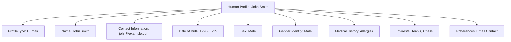

---
tags:

  - profile
  - human
  - identity
  - entity

---

# Human Profile (Entity)

## Overview

A **Human Profile** Entity represents a person within the tournament system. It provides a comprehensive way to handle human profile information for participant management, personal identification, and user experience within the tournament system.

It describes personal characteristics and coordinates with other entities (like [Name](../attributes/name.md), [Contact Information](../contact_information.md), and [Medical History](../attributes/medical_history/medical_history.md)) to provide complete human profile oversight.

It inherits properties from the [Base Profile](base_profile.md) and [Base Entity](../../foundation/base_entity.md).

## Purpose

- Represent individuals participating in tournaments and events
- Manage personal information and characteristics specific to humans
- Support comprehensive profile management including medical and personal data
- Enable integration with accounts, teams, and registration systems

## Structure

This entity inherits all attributes from [Base Profile](base_profile.md) and adds human-specific attributes:

| Attribute               | Description                                               | Type     | Required | Notes / Example                                                     |
| ----------------------- | --------------------------------------------------------- | -------- | -------- | ------------------------------------------------------------------- |
| **Name**                | The person's name information.                            | Object   | Yes      | Embedded [Name](../attributes/name.md) Value Object                               |
| **Contact Information** | The person's contact information.                         | Object   | Optional | Embedded [Contact Information](../contact_information.md) Value Object |
| **Date of Birth**       | The person's date of birth.                               | Object   | Optional | Embedded [Date of Birth](../attributes/date_of_birth.md) Value Object             |
| **Sex**                 | The person's biological sex.                              | Object   | Optional | Embedded [Sex](../attributes/sex.md) Value Object                                 |
| **Gender Identity**     | The person's gender identity.                             | Object   | Optional | Embedded [Gender Identity](../attributes/gender_identity.md) Value Object         |
| **Medical History**     | The person's medical history.                             | Object   | Optional | Embedded [Medical History](../attributes/medical_history/medical_history.md) Value Object         |
| **Interests**           | List of the person's interests.                           | List     | Optional | List of [Interest](../attributes/interest.md) Value Objects                       |
| **Preferences**         | List of the person's preferences.                         | List     | Optional | List of [Preference](../attributes/preference.md) Value Objects                   |

## Example

This example shows a comprehensive human profile with all key attributes including inherited base profile fields and human-specific information.

## Relationships

- A `Human Profile` Entity inherits from [Base Profile](base_profile.md)
- A `Human Profile` Entity is associated with an [Account](../account/account.md) entity
- A `Human Profile` Entity may be associated with [Team](../../team/README.md) entities
- A `Human Profile` Entity may be associated with [Registration](../../registration/README.md) entities

## Considerations

- **Privacy:** Human profile information should be handled with appropriate privacy controls
- **Accuracy:** Profile information should be accurate and up-to-date
- **Consent:** Profile information should be collected with appropriate consent
- **Access Control:** Profile access should be controlled based on permissions
- **Data Retention:** Profile data retention should follow relevant regulations

## See Also

- [Base Profile](base_profile.md)
- [Account](../account/account.md)
- [Contact Information](../contact_information.md)
- [Medical History](../attributes/medical_history/medical_history.md)
- [Name](../attributes/name.md)
- [Identity Domain](../README.md)
- [Team](../../team/README.md)
- [Registration](../../registration/README.md)
