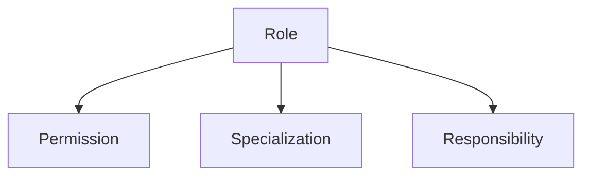

---
tags:
- identity
- role
- permission
- specialization
- responsibility
- domain
---

# Role (Entity)

## Overview
The Role entity defines a set of responsibilities, permissions, and specializations assigned to users or organizations within the Tournament Organizer system. Roles are central to access control and organizational structure.

## Purpose
- Assign responsibilities and permissions to users and organizations
- Enable role-based access control and specialization
- Support management of permissions and responsibilities

## Structure
| Attribute          | Description                                         | Type     | Required | Notes / Example                           |
|--------------------|-----------------------------------------------------|----------|----------|-------------------------------------------|
| **ID**             | Unique identifier for the role entity               | UUID     | Yes      | "role-001"                               |
| **Name**           | Name of the role                                    | String   | Yes      | "Organizer", "Participant", "Admin"      |
| **Description**    | Description of the role                             | String   | Optional | "Manages tournament logistics"           |
| **Permissions**    | List of permissions assigned to the role            | List[UUID]| Optional | References to permission entities         |
| **Specializations**| List of specializations for the role                | List[UUID]| Optional | References to specialization entities     |
| **Responsibilities**| List of responsibilities for the role              | List[UUID]| Optional | References to responsibility entities     |

## Example

This example shows a role entity linked to permissions, specializations, and responsibilities.

## See Also
- [Role](role.md)
- [Specialization](specialization.md)
- [Permission](permission/README.md)
- [Responsibility](responsibility/README.md)
- [Identity](../README.md)
- [Organization](../../organization/README.md)
- [Process](../../process/README.md)
- [Base Entity](../../foundation/base_entity.md)
