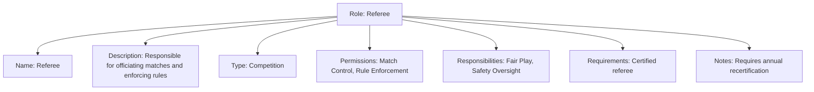

---
tags:
  - role
  - template-entity
  - identity
  - authorization
---

# Role (Template Entity)

## Overview

A Role is a template entity that defines a set of responsibilities, permissions, and requirements within the tournament system. It serves as a standardized definition that can be referenced when assigning roles to participants, staff, or other entities.

As a Template Entity, it possesses a unique identity and lifecycle, managed according to the [Base Entity](../../foundation/base_entity.md). When used, its definition is typically **copied** into the target context, allowing for potential minor modifications or annotations without altering the original template.

It inherits properties from the [Base Entity](../../foundation/base_entity.md).

## Purpose

- Define standardized roles that can be assigned throughout the tournament system
- Manage permissions and responsibilities consistently across different contexts
- Support role-based access control and authorization
- Enable flexible role assignment and customization

## Structure

This template entity includes standard attributes from the [Base Entity](../../foundation/base_entity.md).

| Attribute            | Description                                                                                           | Type       | Required | Notes / Example                                                 |
| -------------------- | ----------------------------------------------------------------------------------------------------- | ---------- | -------- | --------------------------------------------------------------- |
| **Name**             | A descriptive name for the role template.                                                             | String     | Yes      | "Referee", "Player", "Coach", "Administrator"           |
| **Description**      | Detailed description of the role template and its responsibilities.                                   | Text       | Yes      | "Responsible for officiating matches and enforcing rules"     |
| **Type**             | The type of role template.                                                                            | String     | Yes      | "Competition", "Administrative", "Support", "Technical" |
| **Permissions**      | List of [Permission](permission/README.md) entities associated with this role template.               | List[UUID] | Optional | References to permission entities                               |
| **Responsibilities** | List of [Responsibility](responsibility/responsibility.md) entities for this role template.          | List[UUID] | Optional | References to responsibility entities                           |
| **Requirements**     | Specific requirements for this role template.                                                         | Text       | Optional | "Must be certified referee"                                   |
| **Notes**            | Additional notes about the role template.                                                             | Text       | Optional | "Requires annual recertification"                             |

## Example

This example shows a comprehensive role template with all attributes including name, description, type, permissions, responsibilities, requirements, and notes.

## Relationships

### Parent Relationships

- Role assignments that use this template

### Child Relationships

- [Permission](permission/README.md) - Permissions associated with this role
- [Responsibility](responsibility/responsibility.md) - Responsibilities associated with this role

### Related Entities

- [Specialization](specialization.md) - Specializations that can be applied to this role

## Considerations

- **Template Nature**: This template defines a standard role. Instance-specific variations or customizations belong on the copied instance within its specific context.
- **Copy Mechanism**: The process of copying this template definition into a target context needs to be handled by application logic.
- **Permission Management**: Role templates should clearly define associated permissions.
- **Responsibility Assignment**: Role templates should specify associated responsibilities.

## See Also

- [Permission](permission/README.md)
- [Responsibility](responsibility/responsibility.md)
- [Specialization](specialization.md)
- [Account](../account/account.md)
- [Base Entity](../../foundation/base_entity.md)
- [Identity Domain](../README.md)
