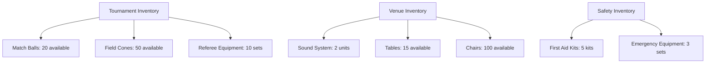

---
tags:

- inventory
- equipment
- supplies
- stock
- tracking

---

# Inventory Domain

## Overview

The Inventory domain manages the tracking, allocation, and availability of physical equipment, supplies, and
resources needed for tournament operations. This domain provides comprehensive inventory management capabilities
including item definitions, stock records, and inventory groupings by organizational context.

## Purpose

This domain enables tournament organizers to:

- Track equipment and supplies across multiple tournaments and venues
- Manage stock levels and availability for planning purposes
- Organize inventory by context (tournament, venue, fixture)
- Monitor item reservations and allocations
- Ensure adequate resources are available for events

## Structure

The inventory domain consists of the following models:

| Model | Type | Purpose |
|-------|------|---------|
| [Inventory](inventory.md) | Template Entity | Groups and manages collections of items by organizational context |
| [Item](item.md) | Template Entity | Defines equipment, supplies, and resources with tracking capabilities |
| [Stock Record](stock_record.md) | Value Object | Embedded tracking data within items for quantity management |

All template entities include standard attributes from the [Base Entity](../foundation/base_entity.md).

## Example

This example shows how inventories organize different categories of items by their operational context. Tournament
inventories focus on competition equipment, venue inventories manage facility resources, and safety inventories
ensure emergency preparedness. Each item tracks quantities and availability to support planning and allocation
decisions.

## References

- [ISO 8000-2:2017 - Data quality - Part 2: Vocabulary](https://www.iso.org/standard/36326.html)
- [ISO 28000:2007 - Specification for security management systems for the supply chain](https://www.iso.org/standard/44651.html)
- [ISO 9001:2015 - Quality management systems — Requirements](https://www.iso.org/standard/62085.html)
- [Domain-Driven Design: Tackling Complexity in the Heart of Software](https://www.amazon.com/Domain-Driven-Design-Tackling-Complexity-Software/dp/0321125215)
  by Eric Evans - Entity and Value Object patterns
- [Event Management Body of Knowledge (EMBOK)](https://www.embok.org/index.php/embok-model) - Event inventory
  management standards

## See Also

- [Tournament README](../tournament/README.md)
- [Schedule README](../schedule/README.md)
- [Media README](../media/README.md)
- [Business README](../README.md)
