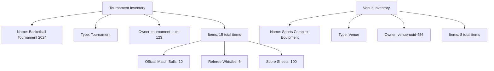

---
tags:

- inventory
- template-entity
- equipment
- organization
- tracking

---

# Inventory (Template Entity)

## Overview

An Inventory template entity represents a collection of [Items](item.md) and their stock records managed by a
specific organization, tournament, venue, or fixture. It provides a way to track, group, and manage items that are
inherently coupled to their location or organizational context.

This template entity includes standard attributes from the [Base Entity](../foundation/base_entity.md).

## Purpose

The Inventory template entity enables:

- Grouping items by organizational context (tournament, venue, fixture)
- Tracking item collections for specific events or locations
- Managing ownership and responsibility for equipment and supplies
- Organizing inventory for planning and allocation purposes

## Structure

| Attribute | Description | Type | Required | Notes |
|-----------|-------------|------|----------|--------|
| Name | Unique identifier for the inventory | String | Yes | "Tournament X Supplies", "Venue Y Equipment" |
| Description | Detailed explanation of the inventory | Text | Yes | "All equipment and supplies for Tournament X" |
| Type | Classification of the inventory | String | Yes | Tournament, Venue, Fixture, Organization |
| Owner | Reference to the owning entity | UUID | Yes | tournament-uuid-x, venue-uuid-y |
| Items | List of references to [Item](item.md) entities | Array | No | [item-uuid-1, item-uuid-2] |

## Example

This example demonstrates how inventory template entities organize equipment by context. The tournament inventory
manages competition-specific items like match balls and referee equipment, while the venue inventory handles
facility-related items. Each inventory clearly identifies its owner and maintains references to its item collection
for efficient tracking and allocation.

## See Also

- [Item](item.md)
- [Stock Record](stock_record.md)
- [Tournament](../tournament/tournament.md)
- [Fixture](../schedule/fixture.md)
