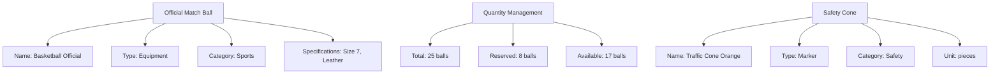

---
tags:

- inventory
- template-entity
- equipment
- supplies
- tracking

---

# Item (Template Entity)

## Overview

An Item template entity represents a specific type of equipment, supply, or resource that can be tracked in
inventories. It defines the base characteristics and categorization of an item, which can then be referenced by
stock records to track actual quantities and by groups for logical organization.

This template entity includes standard attributes from the [Base Entity](../foundation/base_entity.md).

## Purpose

The Item template entity enables:

- Defining equipment and supply types with detailed specifications
- Tracking quantities, reservations, and availability
- Categorizing items for organization and filtering
- Managing stock levels across multiple inventories
- Supporting media attachments for item identification

## Structure

| Attribute | Description | Type | Required | Notes |
|-----------|-------------|------|----------|--------|
| Name | Unique identifier for the item type | String | Yes | "Official Match Ball", "Field Cone" |
| Description | Detailed explanation of the item | Text | Yes | "Official tournament match ball" |
| Type | Classification of the item | String | Yes | Prop, Marker, Equipment, Supply |
| Category | Primary category for grouping | String | Yes | Sports, Technical, Furniture, Safety |
| Unit | Unit of measurement | String | Yes | pieces, sets, pairs |
| Specifications | Technical specifications or requirements | Object | No | { size: "5", material: "leather" } |
| Quantity | Total quantity available | Integer | Yes | 50 |
| Reserved | Quantity currently reserved | Integer | Yes | 10 |
| Available | Quantity currently available | Integer | Yes | 40 |
| Media | List of references to assets | Array | No | [media-uuid-1, media-uuid-2] |

## Example

This example shows how item template entities manage different types of equipment with detailed tracking. The match
ball item includes sports-specific specifications and quantity management, while safety cones provide marking
capabilities. Each item tracks total quantity, reservations, and availability to support accurate allocation and
planning decisions across multiple tournaments and venues.

## See Also

- [Inventory](inventory.md)
- [Stock Record](stock_record.md)
- [Media README](../media/README.md)
