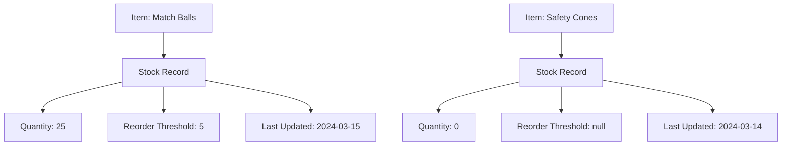

---
tags:

- inventory
- value-object
- stock
- tracking
- embedded

---

# Stock Record (Value Object)

## Overview

A Stock Record value object represents inventory tracking data that is embedded within Item entities. It provides
detailed quantity management, reorder thresholds, and update timestamps to support comprehensive inventory control
within the tournament organization system.

This value object is embedded in [Item](item.md) entities and does not have independent identity.

## Purpose

The Stock Record value object enables:

- Tracking current quantities and stock levels
- Managing reorder thresholds for automatic replenishment alerts
- Recording update timestamps for audit and synchronization
- Embedding inventory control data within item definitions
- Supporting stock management decisions and planning

## Structure

| Attribute | Description | Type | Required | Notes |
|-----------|-------------|------|----------|--------|
| Quantity | Current quantity on hand | Integer | Yes | 50, 0 (out of stock) |
| Reorder Threshold | Threshold below which reordering is triggered | Integer | No | 10, null (no automatic reorder) |
| Last Updated | Timestamp of the last update | DateTime | Yes | 2024-03-15T10:30:00Z |

## Example

This example shows how stock record value objects provide embedded tracking within item entities. The match balls
maintain quantity and reorder threshold information for automated management, while safety cones track current stock
without automatic reordering. Each record includes timestamp data for audit trails and synchronization purposes.

## See Also

- [Item](item.md)
- [Inventory](inventory.md)
