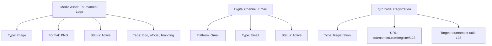

---
tags:

- media
- digital-assets
- communication
- channels
- qr-codes

---

# Media Domain

## Overview

The Media domain manages digital assets, communication channels, and visual elements within the Tournament Organizer
system. It provides comprehensive frameworks for storing, organizing, and referencing media content such as images,
videos, documents, and digital communication channels.

This domain uses a combination of entities and value objects to support both standalone media assets and embedded
media elements within other entities.

## Purpose

This domain enables tournament organizers to:

- Manage digital media assets with comprehensive metadata
- Configure and utilize digital communication channels
- Generate and track QR codes for various purposes
- Organize media content by type, category, and usage
- Ensure secure and efficient media storage and access

## Structure

The media domain consists of the following models:

| Model | Type | Purpose |
|-------|------|---------|
| [Media Asset](media_asset.md) | Entity | Digital media files with comprehensive metadata and lifecycle management |
| [Digital Channel](digital_channel.md) | Value Object | Communication channels embedded in contact information |
| [QR Code](qr_code.md) | Value Object | QR code data and visual representation embedded in entities |

All entities include standard attributes from the [Base Entity](../foundation/base_entity.md).

## Example

This example demonstrates how the media domain handles different types of digital content. Media assets provide
comprehensive file management with metadata and lifecycle tracking, digital channels enable communication platform
integration, and QR codes facilitate quick access to tournament information and actions.

## See Also

- [Media Asset](media_asset.md)
- [Digital Channel](digital_channel.md)
- [QR Code](qr_code.md)
- [Contact Information](../identity/contact_information.md)
