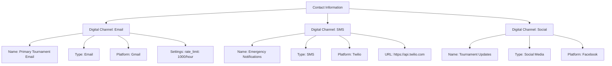

---
tags:

- media
- value-object
- communication
- channels
- embedded

---

# Digital Channel (Value Object)

## Overview

A Digital Channel value object represents a digital communication channel (email, SMS, social media, etc.) that is
embedded within contact information. It provides a consistent way to handle channel information for communication
management, notification delivery, and outreach within the tournament system.

This value object is embedded in contact information entities and does not have independent identity.

## Purpose

The Digital Channel value object enables:

- Defining communication channels with platform-specific information
- Configuring channel settings and credentials securely
- Managing multiple communication platforms consistently
- Supporting various digital communication methods
- Embedding channel data within contact information

## Structure

| Attribute | Description | Type | Required | Notes |
|-----------|-------------|------|----------|--------|
| Name | The name of the digital channel | String | Yes | "Tournament Email", "SMS Notifications", "Social Media" |
| Type | The type of digital channel | String | Yes | Email, SMS, Social Media, Push Notification |
| Platform | The platform or service used for the channel | String | No | Gmail, Twilio, Facebook, Firebase |
| URL | The URL or endpoint for the channel | String | No | "<https://api.twilio.com>", "<https://graph.facebook.com>" |
| Credentials | Reference to stored credentials for the channel | Reference | No | Reference to secure credential storage |
| Settings | Configuration settings for the channel | Object | No | {"rate_limit": 100, "timeout": 30, "retry_count": 3} |

## Example

This example shows how digital channel value objects are embedded within contact information to provide comprehensive
communication capabilities. Each channel specifies its platform, configuration settings, and operational parameters.
The email channel handles bulk communications, SMS provides emergency notifications, and social media enables public
updates and engagement.

## See Also

- [Media Asset](media_asset.md)
- [QR Code](qr_code.md)
- [Contact Information](../identity/contact_information.md)
