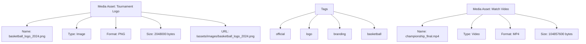

---
tags:

- media
- entity
- digital-assets
- files
- storage

---

# Media Asset (Entity)

## Overview

A Media Asset entity represents a digital media file (image, video, document, audio) within the tournament system.
It provides a consistent way to handle media information for content management, file storage, and media organization
within the tournament system.

This entity includes standard attributes from the [Base Entity](../foundation/base_entity.md).

## Purpose

The Media Asset entity enables:

- Storing and managing digital media files with comprehensive metadata
- Organizing media content by type, format, and tags
- Controlling access and permissions for media assets
- Tracking usage and lifecycle of digital content
- Supporting various media formats and storage solutions

## Structure

| Attribute | Description | Type | Required | Notes |
|-----------|-------------|------|----------|--------|
| Name | The name of the media asset | String | Yes | "tournament_logo.png", "match_highlights.mp4" |
| Type | The type of media asset | String | Yes | Image, Video, Document, Audio |
| Format | The file format of the media asset | String | No | PNG, MP4, PDF, MP3 |
| Size | The file size in bytes | Integer | No | 1024000, 5242880 |
| URL | The URL or path to the media asset | String | No | "/assets/images/logo.png", "<https://cdn.example.com/video.mp4>" |
| Description | Description of the media asset | String | No | "Official tournament logo", "Championship match highlights" |
| Tags | List of tags for categorizing the media asset | Array | No | ["logo", "official", "branding"], ["highlights", "championship"] |

## Example

This example shows how media asset entities manage different types of digital content with comprehensive metadata.
The tournament logo asset includes visual branding information with categorization tags, while the match video asset
handles larger multimedia content. Each asset tracks technical specifications, storage locations, and organizational
metadata to support efficient content management and delivery.

## See Also

- [Digital Channel](digital_channel.md)
- [QR Code](qr_code.md)
