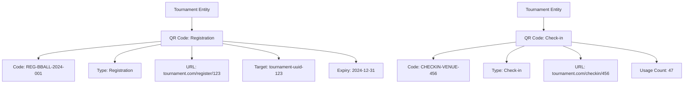

---
tags:

- media
- value-object
- qr-codes
- registration
- embedded

---

# QR Code (Value Object)

## Overview

A QR Code value object represents Quick Response code data that can be scanned to provide quick access to information
or actions within the tournament system. QR codes can be used for various purposes such as registration, check-in,
access control, or information sharing.

This value object is embedded in entities like tournaments and does not have independent identity.

## Purpose

The QR Code value object enables:

- Providing quick access to tournament information and actions
- Facilitating registration and check-in processes
- Encoding various types of data (URLs, IDs, text)
- Supporting different QR code purposes and contexts
- Embedding QR functionality within other entities

## Structure

| Attribute | Description | Type | Required | Notes |
|-----------|-------------|------|----------|--------|
| Code | The actual QR code data or identifier | String | Yes | "REG-2024-001", "CHECKIN-12345" |
| Type | The type or purpose of the QR code | String | Yes | Registration, Check-in, Access, Information |
| URL | The URL or action that the QR code points to | String | Yes | "<https://tournament.com/register/123>" |
| Target | Reference to the entity this QR code is associated with | UUID | No | tournament-uuid-123, participant-uuid-456 |
| Expiry Date | When this QR code expires (if applicable) | DateTime | No | 2024-12-31T23:59:59Z |
| Usage Count | Number of times this QR code has been scanned | Integer | No | 0 (initial value) |
| Notes | Additional notes about the QR code | Text | No | "For tournament registration only" |

## Example

This example shows how QR code value objects are embedded within tournament entities to facilitate various functions.
The registration QR code provides direct access to tournament sign-up with expiration date management, while the
check-in QR code tracks usage for attendance monitoring. Each QR code encodes specific data and maintains contextual
information for its intended purpose.

## See Also

- [Media Asset](media_asset.md)
- [Digital Channel](digital_channel.md)
- [Tournament](../tournament/tournament.md)
