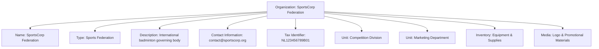

---
tags:
  - template-entity
  - organization
  - data-model
---

# Organization (Template Entity)

## Introduction

The **Organization** Template Entity represents a structured group such as a business, school, sports federation,
sponsor, or supplier involved in the Tournament Organizer ecosystem. It provides a reusable template for creating
organization instances with consistent structure and attributes.

Organizations serve as the foundation for hierarchical management within tournaments, enabling structured relationships
with units, members, venues, and resources across the tournament ecosystem.

## Structure

This template entity includes standard attributes from the [Base Entity](../foundation/base_entity.md).

| Attribute               | Description                                                                                     | Type       | Required | Notes / Example                                                                  |
| ----------------------- | ----------------------------------------------------------------------------------------------- | ---------- | -------- | -------------------------------------------------------------------------------- |
| **Name**                | The official or common name of the organization.                                                | String     | Yes      | Should be unique within a relevant scope. Example: "Global Badminton Federation" |
| **Description**         | A brief description of the organization and its purpose or activities.                          | String     | Optional | "The international governing body for badminton."                                |
| **Type**                | Categorizes the organization.                                                       | String     | Optional | Example: `"Sports Federation"`, `"Educational"`, `"Sponsor"`                     |
| **Contact Information** | Optional reference (by ID) to the primary **[Contact Information](../identity/contact_information.md)** Entity for this organization. | UUID       | Optional | Example: `ci-a1b2c3d4-e5f6-4890-1234-567890abc020`                               |
| **Units**               | List of references (by ID) to internal **[Unit](unit/unit.md)** Entities.                                       | List[UUID] | Optional | Example: `[ou-a1b2c3d4-e5f6-4890-1234-567890abc022]`                             |
| **Tax Identifier**      | Optional tax identification number (e.g., VAT ID, EIN) or similar official registration number. | String     | Optional | Example: "NL123456789B01"                                                        |
| **Media**               | Optional list of references (by ID) to **[Media](../media/media.md)** entities associated with this organization.     | List[UUID] | Optional | Example: `[media-a1b2c3d4-e5f6-4890-1234-567890abc099]`                          |
| **Inventory**           | Reference to the organization's **[Inventory](../inventory/inventory.md)** for managing equipment and supplies.                   | UUID       | Optional | `inventory-uuid-org-x`                                                           |

---

## Example

This example demonstrates a sports federation organization template with comprehensive attributes. SportsCorp
Federation serves as an international governing body with distinct organizational units for competition and marketing.
The organization maintains official contact information, tax identification, and manages both equipment inventory and
promotional media assets for tournament operations.

## See Also

- **[Unit](unit/unit.md)** - Organizational unit structure and management
- **[Target Audience](target_audience.md)** - Audience categorization templates
- **[Contact Information](../identity/contact_information.md)** - Contact details management
- **[Inventory](../inventory/inventory.md)** - Equipment and resource management

---
