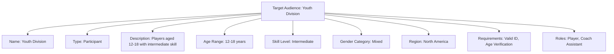

---
tags:
  - template-entity
  - target-audience
  - organization
  - data-model
---

# Target Audience (Template Entity)

## Introduction

A **Target Audience** Template Entity defines a reusable blueprint for identifying and categorizing groups of
participants, spectators, or other stakeholders in a tournament context. It provides standardized audience targeting
templates that ensure consistency across different tournament types and contexts.

Target Audience templates enable precise rule application, safety guideline targeting, and participant categorization
while maintaining flexibility for diverse tournament requirements and organizational structures.

## Structure

This template entity includes standard attributes from the [Base Entity](../foundation/base_entity.md).

| Attribute           | Description                                                  | Type         | Required | Notes / Example                                                                     |
| ------------------- | ------------------------------------------------------------ | ------------ | -------- | ----------------------------------------------------------------------------------- |
| **Name**            | Clear and concise title for the Target Audience.             | String       | Yes      | `"Youth Division"`, `"Professional League"`, `"Spectators"`, `"Officials"`          |
| **Description**     | Detailed explanation of the target audience characteristics. | String       | Yes      | `"Players aged 12-18 with intermediate skill level"`, `"All tournament spectators"` |
| **Type**            | The primary category of the target audience.                 | String       | Yes      | E.g., `Participant`, `Spectator`, `Official`, `Staff`, `Other`                      |
| **Age Range**       | Minimum and maximum age requirements (if applicable).        | Range        | Optional | `{min: 12, max: 18}`, `{min: 18, max: null}`                                        |
| **Skill Level**     | Required skill level (if applicable).                        | String       | Optional | E.g., `Beginner`, `Intermediate`, `Advanced`, `Professional`                        |
| **Gender Category** | Gender category requirements (if applicable).                | String       | Optional | E.g., `Male`, `Female`, `Mixed`, `Open`                                             |
| **Region**          | Geographic region or location requirements (if applicable).  | String       | Optional | `"North America"`, `"Europe"`, `"Global"`                                           |
| **Requirements**    | List of specific requirements for this audience group.       | List[String] | Optional | `["Valid ID", "Skill Certification", "Age Verification"]`                           |
| **Roles**           | List of roles this audience group can fulfill.               | List[String] | Optional | `["Player", "Coach"]`, `["Referee", "Scorekeeper"]`                                 |

---

## Relationships

- A `Target Audience` template can be referenced by:
  - **[Tournament](../tournament/tournament.md)** to define its participant requirements
  - [Rule](../discipline/activity/variation/rule.md) templates to specify which groups the rules apply to
  - Safety Guideline templates to specify which groups the guidelines apply to (*future enhancement*)
- The specific implementation of a target audience within a tournament will be linked to records.
- A target audience may be referenced by multiple entities across the system.

## Example

This example illustrates a Youth Division target audience template designed for intermediate-level tournaments. The
template defines participants aged 12-18 with mixed gender categories and regional scope for North America. Required
verification includes valid identification and age confirmation, while permitted roles encompass both player
participation and coaching assistance opportunities.

## See Also

- **[Organization](organization.md)** - Parent organization template structure
- **[Tournament](../tournament/tournament.md)** - Tournament participant requirements
- **[Rule](../discipline/activity/variation/rule.md)** - Rule application targeting
- **[Safety Guidelines](../safety/safety_guideline.md)** - Safety requirement targeting
