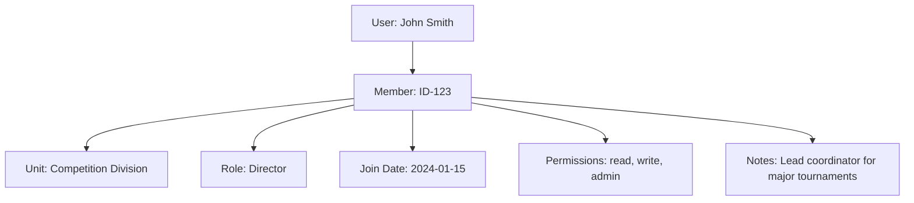

---
tags:
  - entity
  - member
  - organization
  - unit
  - data-model
---

# Member (Entity)

## Introduction

A **Member** Entity represents an individual who belongs to an organizational unit within the tournament system. It
provides membership management for organizational structure, role assignment, and access control.

Members establish the connection between users and organizational units, enabling role-based permissions and
hierarchical organizational management within tournaments.

## Structure

This entity includes standard attributes from the [Base Entity](../../foundation/base_entity.md).

| Attribute       | Description                                        | Type      | Required | Notes / Example                                                                                                                           |
| --------------- | -------------------------------------------------- | --------- | -------- | ----------------------------------------------------------------------------------------------------------------------------------------- |
| **User**        | Reference to the user who is a member.             | UUID      | Yes      | Reference to **[User](../../identity/user.md)** entity                                                                                   |
| **Unit**        | Reference to the organizational unit.              | UUID      | Yes      | Reference to **[Unit](unit.md)** entity                                                                                                  |
| **Role**        | The role of the member within the unit.            | String    | Optional | `"Member"`, `"Leader"`, `"Coordinator"`, `"Administrator"`                                                                                |
| **Join Date**   | The date when the member joined the unit.          | Date      | Yes      | `"2024-01-15"`, `"2024-02-20"`                                                                                                            |
| **Permissions** | List of permissions granted to the member.         | List[String] | Optional | `["read", "write", "admin"]`                                                                                                              |
| **Notes**       | Additional notes about the membership.             | String    | Optional | `"Temporary assignment"`, `"Special access granted"`                                                                                      |

## Example

This example shows a member entity connecting user John Smith to the Competition Division unit. The member has
Director-level access with full permissions and serves as the lead coordinator for major tournaments. The join date
tracks when the membership began, enabling duration-based reporting and access management.

## See Also

- **[Unit](unit.md)** - Organizational unit management
- **[User](../../identity/user.md)** - User identity and profile information
- **[Organization](../organization.md)** - Parent organization structure
