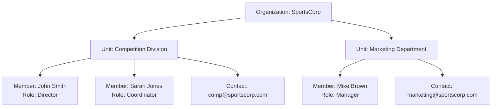

---
tags:
  - entity
  - unit
  - organization
  - data-model
---

# Unit (Entity)

## Introduction

A **Unit** Entity represents a distinct division within an organization, such as a department, team, project group,
or committee. It provides structure for hierarchical organizational management and member assignment within the
tournament system.

Units enable organizational flexibility by supporting both hierarchical relationships (parent-child units) and
collaborative relationships (related units). Each unit can have its own contact information and manage member
assignments with specific roles.

## Structure

This entity includes standard attributes from the [Base Entity](../../foundation/base_entity.md).

| Attribute               | Description                                                                                                                                                                  | Type         | Required | Notes / Example                                                                                                                                |
| ----------------------- | ---------------------------------------------------------------------------------------------------------------------------------------------------------------------------- | ------------ | -------- | ---------------------------------------------------------------------------------------------------------------------------------------------- |
| **Type**                | Defines the role or category of the unit.                                                                                                                                    | String       | Yes      | Example: "Division", "Department", "Team", "Project Group", "Committee", "Working Group"                                                       |
| **Name**                | Clear and identifiable label for the unit.                                                                                                                                   | String       | Yes      | Should be unique within the organization. Example: "Marketing Department"                                                                      |
| **Description**         | Explanation of the unit's purpose, responsibilities, scope.                                                                                                                  | String       | Optional | Example: "Handles all marketing activities for the organization."                                                                              |
| **Contact Information** | Reference (by ID) to the unit's **[Contact Information](../../identity/contact_information.md)**.                                                                                                                                    | UUID         | Optional | Example: `550e8400-e29b-41d4-a716-446655440000`                                                                                                |
| **Units**               | List of references to related **[Unit](unit.md)** entities with their relationship types.                  | List[Object] | No       | Example: `[{"id": "550e8400-e29b-41d4-a716-446655440000", "type": "parent"}, {"id": "6ba7b810-9dad-11d1-80b4-00c04fd430c8", "type": "child"}]` |
| **Members**             | List of **[Member](member.md)** assigned to this unit, each with their role assignments. | List[Object] | No       | Example: `[{"id": "550e8400-e29b-41d4-a716-446655440000", "roles": ["6ba7b810-9dad-11d1-80b4-00c04fd430c8"]}]`                                 |

---

## Example

This example illustrates a sports organization with two primary units. The Competition Division manages tournament
operations with a Director and Coordinator, while the Marketing Department handles promotional activities with a
Manager. Each unit maintains its own contact information and member assignments with clearly defined roles.

## See Also

- **[Organization](../organization.md)** - Parent organization management
- **[Member](member.md)** - Unit membership and role assignment
- **[Contact Information](../../identity/contact_information.md)** - Unit contact details

---
