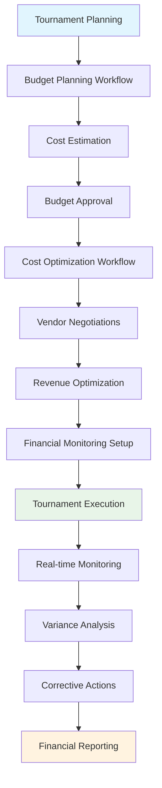

---
tags:
- process
- budget
- financial
- planning
- optimization
- advanced-management
---

# Budget & Financial Planning Process

## Overview

The Budget & Financial Planning Process provides strategic financial planning, cost estimation, budget
optimization, and comprehensive expense management frameworks. This process enables tournament organizers
to develop accurate budgets, optimize costs, monitor financial performance, and ensure sustainable
tournament operations through systematic financial planning and control.

## Purpose

This process addresses the comprehensive financial planning and management requirements for professional
tournament execution, including budget development, cost optimization, revenue planning, and financial
monitoring. It integrates with financial reconciliation, venue management, and performance analysis
processes to deliver complete financial oversight and optimization capabilities.

## Structure

This process includes standard attributes from the [Base Entity](../foundation/base_entity.md) and
encompasses four key workflow areas:

| Component | Type | Description |
|-----------|------|-------------|
| **Budget Planning Workflow** | Process Component | Cost estimation, resource allocation, approval workflows |
| **Cost Optimization Workflow** | Process Component | Expense analysis, efficiency improvements, vendor negotiations |
| **Financial Monitoring Workflow** | Process Component | Real-time budget tracking, variance analysis, alert systems |
| **Revenue Optimization Workflow** | Process Component | Registration pricing, sponsorship management, revenue streams |
| **Integration Points** | Reference Collection | Connections to [Financial Reconciliation Process](../financial_reconciliation/README.md), [Venue Management Process](../venue_logistics_management/README.md), [Performance Analysis Process](../performance_analysis/README.md) |
| **Approval Framework** | Process Component | Budget authorization, spending limits, financial governance |
| **Variance Management** | Process Component | Budget monitoring, deviation analysis, corrective actions |
| **Financial Reporting** | Process Component | Budget reports, financial summaries, stakeholder communication |

## Example

This example demonstrates the comprehensive financial lifecycle from initial budget planning through
active financial monitoring and optimization. The workflow begins with systematic cost estimation and
budget approval, progresses through cost optimization including vendor negotiations and revenue
enhancement, establishes continuous financial monitoring during tournament execution, and provides
real-time variance analysis with corrective actions. This integrated approach ensures effective
financial management that supports tournament success while maintaining budget discipline and
maximizing financial efficiency.

## See Also

- [Financial Reconciliation Process](../financial_reconciliation/README.md) - Financial tracking and reconciliation
- [Venue Management Process](../venue_logistics_management/README.md) - Venue cost coordination
- [Performance Analysis Process](../performance_analysis/README.md) - Financial performance evaluation
- [Resource Allocation Process](../resource_allocation/README.md) - Resource cost management
