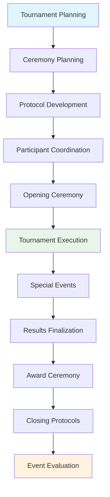

---
tags:
- process
- ceremony
- events
- coordination
- protocol
- advanced-management
---

# Ceremony & Events Coordination Process

## Overview

The Ceremony & Events Coordination Process provides professional event orchestration for opening
ceremonies, award presentations, and special tournament events. This process enables tournament
organizers to deliver memorable ceremonial experiences, coordinate complex event logistics, and
manage dignitary participation while maintaining cultural sensitivity and protocol excellence.

## Purpose

This process addresses the sophisticated ceremony and special event coordination requirements for
professional tournament execution, including ceremonial planning, protocol management, dignitary
coordination, and special event orchestration. It integrates with communication, venue management,
and spectator management processes to deliver exceptional ceremonial experiences that enhance
tournament prestige and stakeholder satisfaction.

## Structure

This process includes standard attributes from the [Base Entity](../foundation/base_entity.md) and
encompasses four key workflow areas:

| Component | Type | Description |
|-----------|------|-------------|
| **Opening Ceremony Workflow** | Process Component | Sequence management, timing coordination, participant coordination |
| **Award Ceremony Workflow** | Process Component | Winner verification, presentation logistics, recognition protocols |
| **Special Events Workflow** | Process Component | Exhibition matches, entertainment coordination, VIP management |
| **Protocol Management Workflow** | Process Component | Dignitary coordination, ceremonial procedures, cultural considerations |
| **Integration Points** | Reference Collection | Connections to [Results Finalization Process](../results_finalization/README.md), [Communication Process](../communication/README.md), [Spectator Management Process](../spectator_media_management/README.md) |
| **Cultural Framework** | Process Component | Cultural sensitivity, traditional protocols, international considerations |
| **Logistics Coordination** | Process Component | Equipment setup, timing management, participant coordination |
| **Quality Assurance** | Process Component | Rehearsal management, protocol verification, execution standards |

## Example

This example demonstrates the comprehensive ceremonial lifecycle from initial planning through event
evaluation. The workflow encompasses opening ceremony coordination with protocol development and
participant management, maintains special event coordination during tournament execution, culminates
in award ceremony presentation following results finalization, and concludes with closing protocols
and evaluation. This integrated approach ensures memorable ceremonial experiences that enhance
tournament prestige, recognize achievement excellence, and create lasting positive impressions.

## See Also

- [Results Finalization Process](../results_finalization/README.md) - Award ceremony coordination
- [Communication Process](../communication/README.md) - Ceremonial communication and announcements
- [Spectator Management Process](../spectator_media_management/README.md) - Audience ceremony coordination
- [Venue Management Process](../venue_logistics_management/README.md) - Ceremonial venue setup
