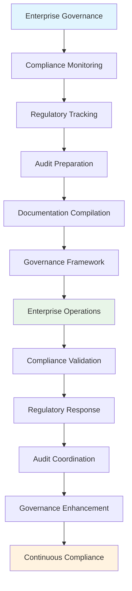

---
tags:
- process
- compliance
- regulatory
- management
- enterprise
- strategic-governance
---

# Compliance & Regulatory Management Process

## Overview

The Compliance & Regulatory Management Process provides advanced compliance tracking, regulatory
adherence, audit preparation, and governance framework management. This process enables tournament
organizations to maintain comprehensive regulatory compliance, prepare for external audits,
and establish enterprise-grade governance frameworks that ensure legal and regulatory adherence
across all tournament management activities.

## Purpose

This process addresses the critical compliance and regulatory management requirements for
enterprise tournament operations, including compliance monitoring, regulatory response,
audit preparation, and governance framework implementation. It integrates with audit trail
generation, financial reconciliation, and risk management processes to deliver comprehensive
compliance coverage and regulatory excellence.

## Structure

This process includes standard attributes from the [Base Entity](../foundation/base_entity.md) and
encompasses four key workflow areas:

| Component | Type | Description |
|-----------|------|-------------|
| **Compliance Monitoring Workflow** | Process Component | Regulatory tracking, requirement analysis, adherence validation |
| **Audit Preparation Workflow** | Process Component | Documentation compilation, evidence preparation, audit coordination |
| **Regulatory Response Workflow** | Process Component | Requirement interpretation, implementation planning, compliance verification |
| **Governance Framework Workflow** | Process Component | Policy development, procedure standardization, oversight coordination |
| **Integration Points** | Reference Collection | Connections to [Audit Trail Generation Process](../audit_trail_generation/README.md), [Financial Reconciliation Process](../financial_reconciliation/README.md), [Risk Management Process](../risk_safety_management/README.md) |
| **Compliance Framework** | Process Component | Regulatory databases, compliance tracking, violation management |
| **Documentation System** | Process Component | Evidence management, record keeping, audit trail maintenance |
| **Governance Structure** | Process Component | Policy frameworks, oversight mechanisms, accountability systems |

## Example

This example demonstrates the comprehensive compliance lifecycle from initial regulatory tracking
through continuous compliance management. The workflow begins with systematic compliance monitoring
and regulatory tracking, progresses through audit preparation and documentation compilation,
implements governance frameworks during enterprise operations, and maintains ongoing compliance
validation and regulatory response. This integrated approach ensures comprehensive regulatory
adherence, audit readiness, and enterprise-grade governance that supports organizational
credibility and legal compliance across all tournament management activities.

## See Also

- [Audit Trail Generation Process](../audit_trail_generation/README.md) - Compliance documentation and evidence
- [Financial Reconciliation Process](../financial_reconciliation/README.md) - Financial compliance tracking
- [Risk Management Process](../risk_safety_management/README.md) - Regulatory risk management
- [Template Standards Process](../template_standards_management/README.md) - Compliance standardization
