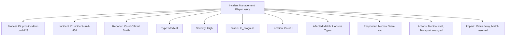

---
tags:
- process
- incident
- management
- escalation
- resolution
---

# Incident Management Process

## Overview

The Incident Management Process provides systematic handling of issues, disruptions, and emergencies that occur
during tournament operations. This process ensures rapid response, proper escalation, and comprehensive
documentation for operational continuity and risk management.

## Purpose

- **Issue Reporting**: Standardized incident capture and classification system
- **Escalation Management**: Structured escalation paths based on incident severity
- **Resolution Tracking**: Comprehensive monitoring of incident resolution progress
- **Risk Mitigation**: Proactive risk assessment and mitigation strategies
- **Compliance Documentation**: Complete audit trail for regulatory and insurance requirements

## Structure

This template entity includes standard attributes from the **[Base Entity](../../foundation/base_entity.md)**
and adds the following process-specific attributes:

| Attribute | Description | Type | Required | Notes / Example |
|-----------|-------------|------|----------|-----------------|
| **Process ID** | Unique identifier for the incident management process | UUID | Yes | `proc-incident-uuid-123` |
| **Incident ID** | Unique identifier for the specific incident | UUID | Yes | `incident-uuid-456` |
| **Reporter** | Reference to the **[Registrant](../../identity/registrant.md)** who reported the incident | UUID | Yes | `reporter-uuid-789` |
| **Incident Type** | Category classification of the incident | String | Yes | `"Medical"`, `"Safety"`, `"Equipment"`, `"Behavioral"`, `"Weather"`, `"Security"`, `"Technical"` |
| **Severity Level** | Impact and urgency classification | String | Yes | `"Low"`, `"Medium"`, `"High"`, `"Critical"`, `"Emergency"` |
| **Current Status** | Current state of incident resolution | String | Yes | `"Reported"`, `"Acknowledged"`, `"Assigned"`, `"In_Progress"`, `"Escalated"`, `"Resolved"`, `"Closed"` |
| **Location** | Where the incident occurred | String | Yes | `"Court 1"`, `"Main Entrance"`, `"Parking Lot"`, `"Concession Stand"` |
| **Affected Match** | Reference to **[Match](../../schedule/match.md)** if incident affects ongoing match | UUID | Optional | `match-uuid-012` |
| **Description** | Detailed description of the incident | Text | Yes | `"Player sustained ankle injury during second period play"` |
| **Immediate Actions** | Initial response actions taken | Array | Yes | `["Medical team dispatched", "Play suspended", "Area secured"]` |
| **Assigned Responder** | Reference to **[Registrant](../../identity/registrant.md)** handling the incident | UUID | Optional | `responder-uuid-345` |
| **Escalation Path** | Current escalation level and next steps | JSON | Optional | `{"current_level": "venue_manager", "next_level": "tournament_director", "escalation_criteria": "if_not_resolved_30min"}` |
| **Resolution Actions** | Actions taken to resolve the incident | Array | Optional | `["Medical evaluation completed", "Player transported to hospital", "Match resumed"]` |
| **Impact Assessment** | Assessment of incident impact on tournament | JSON | Optional | `{"match_delay": "15min", "schedule_impact": "minimal", "cost_estimate": 500}` |
| **Follow Up Required** | Indicates if follow-up actions are needed | Boolean | Yes | `true`, `false` |
| **Insurance Claim** | Insurance claim reference if applicable | String | Optional | `"claim-2024-basketball-injury-001"` |

## Example

This example demonstrates an incident management process for a player injury during the Lions vs Tigers match.
Court Official Smith reported a high-severity medical incident on Court 1, currently being handled by the Medical
Team Lead. The process shows immediate medical evaluation and transport arrangements, with a 15-minute match delay
before resumption.

## See Also

- **[Match Execution](../match_execution/README.md)** - Integration with ongoing match processes
- **[Registrant](../../identity/registrant.md)** - Reporter and responder identity management
- **[Venue](../../venue/README.md)** - Venue-specific incident response procedures
- **[Safety Protocols](../../safety/README.md)** - Safety domain integration and procedures
- **[Communication](../../communication/README.md)** - Incident notification and communication systems
