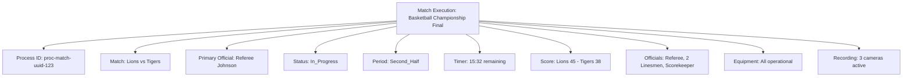

---
tags:
- process
- match
- execution
- tournament
- scoring
---

# Match Execution Process

## Overview

The Match Execution Process manages the complete workflow for conducting individual matches within tournaments.
This process encompasses pre-match setup, real-time match management, scoring, timing, and post-match procedures
with comprehensive audit trails for competition integrity.

## Purpose

- **Match Management**: Systematic execution of tournament matches from start to finish
- **Timing Control**: Precise time management and match duration tracking
- **Score Recording**: Accurate and verified score capture and validation
- **Official Coordination**: Integration with match officials and their responsibilities
- **Incident Handling**: Real-time incident management and documentation during matches

## Structure

This template entity includes standard attributes from the **[Base Entity](../../foundation/base_entity.md)**
and adds the following process-specific attributes:

| Attribute | Description | Type | Required | Notes / Example |
|-----------|-------------|------|----------|-----------------|
| **Process ID** | Unique identifier for the match execution process | UUID | Yes | `proc-match-uuid-123` |
| **Match Reference** | Reference to the **[Match](../../schedule/match.md)** being executed | UUID | Yes | `match-uuid-456` |
| **Primary Official** | Reference to the **[Official](../../identity/official.md)** overseeing the match | UUID | Yes | `official-uuid-789` |
| **Execution Status** | Current state of the match execution | String | Yes | `"Scheduled"`, `"Pre_Match"`, `"In_Progress"`, `"Halftime"`, `"Completed"`, `"Suspended"`, `"Cancelled"` |
| **Current Period** | Current game period or set being played | String | Yes | `"Warm_Up"`, `"First_Half"`, `"Halftime"`, `"Second_Half"`, `"Overtime"`, `"Post_Match"` |
| **Match Timer** | Real-time match timer information | JSON | Yes | `{"current_time": "15:32", "period_duration": "20:00", "timer_running": true}` |
| **Score State** | Current score and scoring information | JSON | Yes | `{"team_a": 45, "team_b": 38, "last_score": "team_a", "scoring_events": [...]}` |
| **Officials Assigned** | All officials assigned to this match | Array | Yes | `["referee-uuid-1", "linesmen-uuid-2", "scorekeeper-uuid-3"]` |
| **Equipment Status** | Status of match equipment and setup | JSON | Optional | `{"scoreboard": "operational", "timing_system": "active", "venue_setup": "complete"}` |
| **Incidents** | Log of incidents occurring during the match | Array | Optional | `[{"time": "12:45", "type": "foul", "description": "Technical foul called", "official": "ref-uuid"}]` |
| **Substitutions** | Record of player substitutions during match | Array | Optional | `[{"team": "team-a", "out": "player-5", "in": "player-12", "time": "10:30"}]` |
| **Time Extensions** | Any time extensions or stoppages | Array | Optional | `[{"reason": "injury", "duration": "PT3M", "period": "second_half"}]` |
| **Video Recording** | Status and references to match recordings | JSON | Optional | `{"recording": true, "cameras": 3, "storage_location": "server/matches/2024/match-456"}` |
| **Weather Conditions** | Environmental conditions affecting the match | JSON | Optional | `{"temperature": "22C", "humidity": "65%", "wind": "light", "precipitation": "none"}` |

## Example

This example demonstrates a match execution process for a basketball championship final between Lions and Tigers.
Referee Johnson is overseeing the match currently in the second half with 15:32 remaining. The Lions lead 45-38
with all equipment operational, full official crew assigned, and video recording active with three cameras for
comprehensive match documentation.

## See Also

- **[Match](../../schedule/match.md)** - Match entity being executed
- **[Official](../../identity/official.md)** - Match officials and their roles
- **[Scoring System](../../tournament/scoring.md)** - Scoring rules and validation
- **[Venue](../../venue/README.md)** - Venue facilities and equipment integration
- **[Incident Management](../incident_management/README.md)** - Real-time incident handling process
