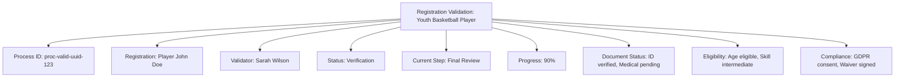

---
tags:
- process
- registration
- validation
- audit
- verification
---

# Registration Validation Process

## Overview

The Registration Validation Process manages the comprehensive verification workflow for tournament registrations.
This process ensures data integrity, eligibility compliance, and participant verification through systematic
validation checks and audit trail maintenance.

## Purpose

- **Document Verification**: Systematic validation of registration documents and credentials
- **Eligibility Checking**: Comprehensive verification of participant eligibility criteria
- **Data Validation**: Integrity checks for registration data and business rule compliance
- **Audit Trail**: Complete tracking of validation decisions and verification results
- **Compliance Assurance**: Regulatory and organizational compliance verification

## Structure

This template entity includes standard attributes from the **[Base Entity](../../foundation/base_entity.md)**
and adds the following process-specific attributes:

| Attribute | Description | Type | Required | Notes / Example |
|-----------|-------------|------|----------|-----------------|
| **Process ID** | Unique identifier for the validation process instance | UUID | Yes | `proc-valid-uuid-123` |
| **Registration Reference** | Reference to the **[Registration](../../registration/registration.md)** being validated | UUID | Yes | `registration-uuid-456` |
| **Validator** | Reference to the **[Registrant](../../identity/registrant.md)** performing validation | UUID | Yes | `validator-uuid-789` |
| **Validation Status** | Current state of the validation process | String | Yes | `"Initiated"`, `"Document_Review"`, `"Eligibility_Check"`, `"Verification"`, `"Approved"`, `"Rejected"`, `"Suspended"` |
| **Current Step** | Specific validation step being executed | String | Yes | `"Document Upload"`, `"Identity Verification"`, `"Eligibility Assessment"`, `"Final Review"` |
| **Progress Percentage** | Completion percentage of validation process | Integer | Yes | `0-100` |
| **Validation Rules** | Set of rules applied during validation | Array | Yes | `["age_verification", "skill_level_check", "document_authenticity"]` |
| **Document Status** | Status of document verification | JSON | Optional | `{"id_card": "verified", "medical_clearance": "pending", "waiver": "approved"}` |
| **Eligibility Results** | Results of eligibility checking | JSON | Optional | `{"age_eligible": true, "skill_level": "intermediate", "prior_violations": false}` |
| **Verification Evidence** | Supporting evidence for validation decisions | Array | Optional | `[{"type": "photo_id", "verified_by": "validator-uuid", "timestamp": "2024-05-15T10:30:00Z"}]` |
| **Rejection Reasons** | Detailed reasons if validation is rejected | Array | Optional | `[{"rule": "age_verification", "reason": "insufficient_documentation", "details": "Birth certificate required"}]` |
| **Appeal Status** | Status of any appeals against validation decisions | String | Optional | `"No_Appeal"`, `"Appeal_Submitted"`, `"Under_Review"`, `"Appeal_Approved"`, `"Appeal_Denied"` |
| **Compliance Flags** | Regulatory compliance markers | JSON | Optional | `{"gdpr_consent": true, "medical_clearance": true, "liability_waiver": true}` |

## Example

This example demonstrates a registration validation process for a youth basketball player. Sarah Wilson is
validating John Doe's registration, currently at 90% completion in the final review step. The process shows
verified identity documents with pending medical clearance, confirmed age eligibility with intermediate skill
level assessment, and completed compliance requirements for GDPR consent and liability waiver.

## See Also

- **[Registration](../../registration/registration.md)** - Registration entity being validated
- **[Registrant](../../identity/registrant.md)** - Participant and validator identity management
- **[Tournament](../../tournament/tournament.md)** - Tournament-specific validation requirements
- **[Role Assignment](../role_assignment.md)** - Validator role and permission management
- **[Organization](../../organization/README.md)** - Organizational validation policies and compliance
