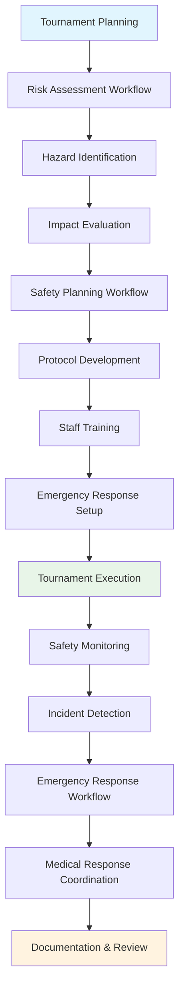

---
tags:
- process
- risk
- safety
- emergency
- management
- advanced-management
---

# Risk Assessment & Safety Management Process

## Overview

The Risk Assessment & Safety Management Process provides systematic safety planning, risk identification,
mitigation strategies, and emergency response coordination frameworks. This process enables tournament
organizers to proactively identify potential hazards, implement comprehensive safety protocols, and
coordinate effective emergency response procedures throughout tournament operations.

## Purpose

This process addresses the critical safety and risk management requirements for professional tournament
execution, including hazard identification, safety protocol development, emergency preparedness, and
incident response coordination. It integrates with venue management, incident management, and
communication processes to ensure comprehensive safety coverage and regulatory compliance.

## Structure

This process includes standard attributes from the [Base Entity](../foundation/base_entity.md) and
encompasses four key workflow areas:

| Component | Type | Description |
|-----------|------|-------------|
| **Risk Assessment Workflow** | Process Component | Hazard identification, probability analysis, impact evaluation |
| **Safety Planning Workflow** | Process Component | Protocol development, equipment requirements, staff training |
| **Emergency Response Workflow** | Process Component | Incident detection, escalation procedures, response coordination |
| **Medical Response Workflow** | Process Component | First aid coordination, medical incident tracking, evacuation procedures |
| **Integration Points** | Reference Collection | Connections to [Incident Management Process](../incident_management/README.md), [Venue Management Process](../venue_logistics_management/README.md), [Communication Process](../communication/README.md) |
| **Compliance Framework** | Process Component | Regulatory requirements, safety standards, audit procedures |
| **Training Coordination** | Process Component | Staff preparation, certification management, drill procedures |
| **Documentation Management** | Process Component | Safety records, incident reports, compliance documentation |

## Example

This example demonstrates the comprehensive safety lifecycle from initial risk assessment through active
safety monitoring and emergency response. The workflow begins with systematic hazard identification and
impact evaluation, progresses through comprehensive safety planning including protocol development and
staff training, maintains continuous safety monitoring during tournament execution, and provides
coordinated emergency response when incidents occur. This integrated approach ensures proactive safety
management that protects participants, officials, and spectators while maintaining regulatory compliance.

## See Also

- [Incident Management Process](../incident_management/README.md) - Incident tracking and resolution
- [Venue Management Process](../venue_logistics_management/README.md) - Venue safety coordination
- [Communication Process](../communication/README.md) - Emergency communication protocols
- [Quality Assessment Process](../quality_assessment/README.md) - Safety standard validation
