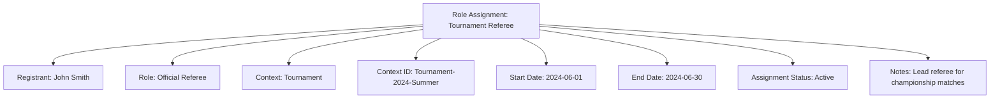

---
tags:
  - template-entity
  - role-assignment
  - process
  - workflow
  - data-model
---

# Role Assignment (Template Entity)

## Introduction

A **Role Assignment** Template Entity represents the assignment of a specific role to a participant within a particular
context, such as a tournament, team, or organization. It provides a reusable template for managing role-participant
relationships, including assignment details, temporal constraints, and status tracking.

Role Assignment templates enable consistent role management across different contexts while maintaining flexibility for
diverse organizational structures and tournament requirements.

## Structure

This template entity includes standard attributes from the [Base Entity](../foundation/base_entity.md).

| Attribute      | Description                                                                           | Type   | Required | Notes / Example                                       |
| -------------- | ------------------------------------------------------------------------------------- | ------ | -------- | ----------------------------------------------------- |
| **Registrant** | Reference to the **[Registrant](../identity/registrant.md)** being assigned the role. | UUID   | Yes      | `registrant-uuid-123`                                 |
| **Role**       | Reference to the **[Role](../identity/role.md)** being assigned.                      | UUID   | Yes      | `role-uuid-referee`                                   |
| **Context**    | The context in which this role assignment applies.                                    | String | Yes      | `"Tournament"`, `"Team"`, `"Organization"`            |
| **Context ID** | Reference to the specific entity (Tournament, Team, etc.) this assignment applies to. | UUID   | Yes      | `tournament-uuid-456`                                 |
| **Start Date** | When this role assignment becomes effective.                                          | Date   | Yes      | `2024-06-01`                                          |
| **End Date**   | When this role assignment expires (optional for ongoing assignments).                 | Date   | Optional | `2024-06-30`                                          |
| **Assignment Status** | Current status of the role assignment.                                        | String | Yes      | `"Active"`, `"Inactive"`, `"Pending"`, `"Terminated"` |
| **Notes**      | Additional notes about the role assignment.                                           | Text   | Optional | `"Temporary assignment due to staff shortage"`        |

## Example

This example demonstrates a role assignment template for a tournament referee. John Smith is assigned the Official
Referee role for the Summer 2024 Tournament, with active status from June 1-30, 2024. The assignment includes
specific notes about responsibilities for championship matches, enabling clear tracking of role assignments and their
temporal constraints.

## See Also

- **[Role](../identity/role.md)** - Role definition and management
- **[Registrant](../identity/registrant.md)** - Participant registration management
- **[Tournament](../tournament/tournament.md)** - Tournament context integration
- **[Organization](../organization/README.md)** - Organizational context management
