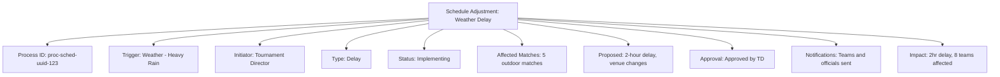

---
tags:
- process
- schedule
- adjustment
- rescheduling
- notification
---

# Schedule Adjustment Process

## Overview

The Schedule Adjustment Process manages systematic modifications to tournament schedules in response to delays,
incidents, venue changes, or other operational requirements. This process ensures stakeholder communication,
conflict resolution, and maintains tournament integrity through controlled schedule modifications.

## Purpose

- **Delay Management**: Systematic handling of match delays and their cascading effects
- **Conflict Resolution**: Resolution of scheduling conflicts and resource constraints
- **Stakeholder Communication**: Comprehensive notification of schedule changes to all affected parties
- **Impact Analysis**: Assessment of schedule change impacts on tournament operations
- **Approval Workflow**: Structured approval process for significant schedule modifications

## Structure

This template entity includes standard attributes from the **[Base Entity](../../foundation/base_entity.md)**
and adds the following process-specific attributes:

| Attribute | Description | Type | Required | Notes / Example |
|-----------|-------------|------|----------|-----------------|
| **Process ID** | Unique identifier for the schedule adjustment process | UUID | Yes | `proc-sched-uuid-123` |
| **Adjustment Trigger** | The event or reason causing the schedule adjustment | String | Yes | `"Match_Delay"`, `"Venue_Issue"`, `"Weather"`, `"Incident"`, `"Resource_Conflict"`, `"Request"` |
| **Initiator** | Reference to the **[Registrant](../../identity/registrant.md)** who initiated the adjustment | UUID | Yes | `initiator-uuid-789` |
| **Affected Matches** | Array of **[Match](../../schedule/match.md)** references affected by adjustment | Array | Yes | `["match-uuid-001", "match-uuid-002", "match-uuid-003"]` |
| **Adjustment Type** | Type of schedule modification being made | String | Yes | `"Delay"`, `"Reschedule"`, `"Venue_Change"`, `"Time_Change"`, `"Cancellation"`, `"Postponement"` |
| **Current Status** | Current state of the adjustment process | String | Yes | `"Initiated"`, `"Analyzing"`, `"Proposed"`, `"Approved"`, `"Implementing"`, `"Completed"`, `"Rejected"` |
| **Original Schedule** | Backup of original schedule data before adjustment | JSON | Yes | `{"match_id": "match-001", "original_time": "14:00", "original_venue": "court-1"}` |
| **Proposed Changes** | Detailed proposed schedule modifications | JSON | Yes | `{"match_id": "match-001", "new_time": "15:30", "new_venue": "court-2", "reason": "court_maintenance"}` |
| **Impact Analysis** | Assessment of adjustment impact on tournament | JSON | Optional | `{"matches_affected": 5, "teams_notified": 8, "delay_duration": "PT90M", "cost_impact": 200}` |
| **Approval Required** | Whether adjustment requires formal approval | Boolean | Yes | `true`, `false` |
| **Approver** | Reference to **[Registrant](../../identity/registrant.md)** who approved the adjustment | UUID | Optional | `approver-uuid-456` |
| **Notification Status** | Status of stakeholder notifications | JSON | Optional | `{"teams": "sent", "officials": "sent", "spectators": "pending", "media": "not_required"}` |
| **Resource Reallocation** | Changes to venue, equipment, or staff assignments | JSON | Optional | `{"venue_changes": [...], "official_reassignments": [...], "equipment_moves": [...]}` |
| **Rollback Plan** | Plan for reverting changes if needed | JSON | Optional | `{"rollback_possible": true, "deadline": "13:00", "requirements": ["official_availability"]}` |
| **Communication Messages** | Messages sent to stakeholders about changes | Array | Optional | `[{"recipient": "teams", "message": "Match delayed 90 minutes", "sent_at": "12:30"}]` |

## Example

This example demonstrates a schedule adjustment process triggered by heavy rain weather. The Tournament Director
initiated a 2-hour delay affecting 5 outdoor matches, with venue changes to indoor courts. The adjustment has been
approved and is currently being implemented, with notifications sent to teams and officials, affecting 8 teams
total.

## See Also

- **[Schedule](../../schedule/README.md)** - Tournament scheduling domain and match management
- **[Match](../../schedule/match.md)** - Individual match entities being adjusted
- **[Venue](../../venue/README.md)** - Venue availability and capacity management
- **[Communication](../../communication/README.md)** - Stakeholder notification systems
- **[Incident Management](../incident_management/README.md)** - Integration with incident response processes
