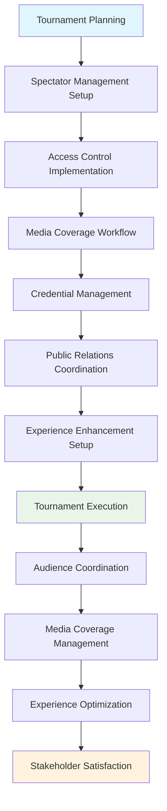

---
tags:
- process
- spectator
- media
- audience
- management
- advanced-management
---

# Spectator & Media Management Process

## Overview

The Spectator & Media Management Process provides professional audience coordination, media relations,
and enhanced tournament experience management frameworks. This process enables tournament organizers
to manage spectator access and experience, coordinate media coverage and relations, and deliver
professional tournament presentation that enhances stakeholder satisfaction and tournament visibility.

## Purpose

This process addresses the comprehensive spectator and media management requirements for professional
tournament execution, including audience coordination, media coverage facilitation, public relations
management, and experience optimization. It integrates with communication, venue management, and
safety processes to deliver exceptional tournament experiences for all stakeholders.

## Structure

This process includes standard attributes from the [Base Entity](../foundation/base_entity.md) and
encompasses four key workflow areas:

| Component | Type | Description |
|-----------|------|-------------|
| **Spectator Management Workflow** | Process Component | Access control, behavior monitoring, experience optimization |
| **Media Coverage Workflow** | Process Component | Credential management, content approval, broadcasting coordination |
| **Public Relations Workflow** | Process Component | Communication strategy, press releases, stakeholder engagement |
| **Experience Enhancement Workflow** | Process Component | Amenity coordination, engagement activities, feedback collection |
| **Integration Points** | Reference Collection | Connections to [Communication Process](../communication/README.md), [Venue Management Process](../venue_logistics_management/README.md), [Safety Management Process](../risk_safety_management/README.md) |
| **Access Control Framework** | Process Component | Ticketing systems, security coordination, entry management |
| **Content Management** | Process Component | Media guidelines, content approval, intellectual property protection |
| **Stakeholder Coordination** | Process Component | VIP management, sponsor recognition, community engagement |

## Example

This example demonstrates the comprehensive spectator and media lifecycle from initial access control
setup through active audience and media coordination. The workflow begins with spectator management
setup including access control implementation, progresses through media coverage coordination with
credential management and content approval, maintains public relations and experience enhancement
during tournament execution, and delivers optimized stakeholder satisfaction. This integrated approach
ensures professional tournament presentation that maximizes audience experience, media coverage
effectiveness, and overall tournament visibility and success.

## See Also

- [Communication Process](../communication/README.md) - Media communication and public relations
- [Venue Management Process](../venue_logistics_management/README.md) - Spectator facility coordination
- [Safety Management Process](../risk_safety_management/README.md) - Crowd safety and security
- [Quality Assessment Process](../quality_assessment/README.md) - Experience quality evaluation
