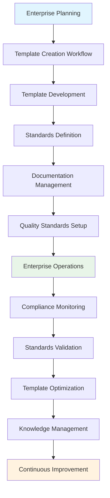

---
tags:
- process
- template
- standards
- management
- enterprise
- strategic-governance
---

# Template & Standards Management Process

## Overview

The Template & Standards Management Process provides comprehensive template systems and standardization
frameworks for organizational consistency across all tournament operations. This process enables
tournament organizations to establish enterprise-level consistency, maintain quality standards,
and optimize operational efficiency through systematic template management and standardization
across all tournament management activities.

## Purpose

This process addresses the comprehensive template and standards management requirements for
enterprise tournament operations, including template creation and maintenance, standards
definition and enforcement, documentation management, and quality assurance. It integrates
with quality assessment, process improvement, and all operational processes to deliver
systematic organizational consistency and operational excellence.

## Structure

This process includes standard attributes from the [Base Entity](../foundation/base_entity.md) and
encompasses four key workflow areas:

| Component | Type | Description |
|-----------|------|-------------|
| **Template Creation Workflow** | Process Component | Standard template development, version control, approval workflows |
| **Standards Definition Workflow** | Process Component | Organizational standards development, compliance tracking, enforcement |
| **Documentation Management Workflow** | Process Component | Centralized documentation, version control, access management |
| **Quality Standards Workflow** | Process Component | Consistency validation, standard compliance, improvement tracking |
| **Integration Points** | Reference Collection | Connections to [Quality Assessment Process](../quality_assessment/README.md), [Process Improvement Process](../process_improvement/README.md), all operational processes |
| **Version Control Framework** | Process Component | Template versioning, change management, approval tracking |
| **Compliance Monitoring** | Process Component | Standards adherence, quality validation, enforcement procedures |
| **Knowledge Management** | Process Component | Best practices capture, organizational learning, continuous improvement |

## Example

This example demonstrates the comprehensive template and standards lifecycle from initial template
creation through continuous improvement. The workflow begins with systematic template development
and standards definition, progresses through documentation management and quality standards
implementation, maintains compliance monitoring during enterprise operations, and provides
ongoing template optimization and knowledge management. This integrated approach ensures
organizational consistency, operational excellence, and systematic continuous improvement
across all tournament management activities.

## See Also

- [Quality Assessment Process](../quality_assessment/README.md) - Quality validation and compliance monitoring
- [Process Improvement Process](../process_improvement/README.md) - Template and standards optimization
- [System Integration Process](../system_integration_optimization/README.md) - Enterprise-level coordination
- [Compliance Management Process](../compliance_regulatory_management/README.md) - Standards enforcement
