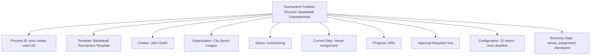

---
tags:
- process
- tournament
- creation
- audit
- template
---

# Tournament Creation Process

## Overview

The Tournament Creation Process manages the complete workflow for establishing new tournaments within the
system. This process encompasses template selection, customization, validation, and finalization steps that
ensure tournament integrity and compliance from inception.

## Purpose

- **Structured Creation Workflow**: Step-by-step guidance for tournament establishment
- **Template Management**: Selection and customization of tournament templates
- **Validation Framework**: Comprehensive checks for business rules and data integrity
- **Audit Trail**: Complete tracking of creation decisions and modifications
- **Recovery Capabilities**: Ability to resume or rollback creation processes

## Structure

This template entity includes standard attributes from the **[Base Entity](../../foundation/base_entity.md)**
and adds the following process-specific attributes:

| Attribute | Description | Type | Required | Notes / Example |
|-----------|-------------|------|----------|-----------------|
| **Process ID** | Unique identifier for the creation process instance | UUID | Yes | `proc-create-uuid-123` |
| **Template Reference** | Reference to the **[Tournament Template](../../tournament/tournament.md)** being used | UUID | Yes | `template-uuid-456` |
| **Creator** | Reference to the **[Registrant](../../identity/registrant.md)** initiating the creation | UUID | Yes | `creator-uuid-789` |
| **Organization** | Reference to the **[Organization](../../organization/README.md)** hosting the tournament | UUID | Yes | `org-uuid-012` |
| **Process Status** | Current state of the creation process | String | Yes | `"Initiated"`, `"Template_Selected"`, `"Customizing"`, `"Validating"`, `"Approved"`, `"Completed"`, `"Failed"`, `"Cancelled"` |
| **Current Step** | Specific step currently being executed | String | Yes | `"Template Selection"`, `"Basic Configuration"`, `"Venue Assignment"`, `"Schedule Setup"`, `"Final Review"` |
| **Progress Percentage** | Completion percentage of the creation process | Integer | Yes | `0-100` |
| **Validation Results** | Results from business rule validation checks | JSON | Optional | `{"venue": "valid", "schedule": "conflict_detected"}` |
| **Configuration Data** | Custom tournament configuration parameters | JSON | Optional | `{"max_teams": 32, "registration_deadline": "2024-06-01"}` |
| **Approval Required** | Whether organization approval is required for this tournament | Boolean | Yes | `true`, `false` |
| **Approver** | Reference to the **[Registrant](../../identity/registrant.md)** who approved the tournament | UUID | Optional | `approver-uuid-345` |
| **Error Log** | Detailed log of any errors encountered during creation | Array | Optional | `[{"step": "validation", "error": "venue_unavailable", "timestamp": "2024-05-15T10:30:00Z"}]` |
| **Recovery Data** | State information for process recovery and resumption | JSON | Optional | `{"last_completed_step": "venue_assignment", "checkpoint_data": {...}}` |

## Example

This example demonstrates a tournament creation process for a basketball championship. John Smith from the
City Sports League is creating a tournament using the Basketball Tournament Template. The process is currently
at 60% completion in the venue assignment step, requiring organizational approval before finalization. The system
maintains detailed configuration data and recovery checkpoints to ensure process continuity.

## See Also

- **[Tournament](../../tournament/tournament.md)** - Tournament template entity structure
- **[Organization](../../organization/README.md)** - Organizational context and approval workflows
- **[Registrant](../../identity/registrant.md)** - Creator and approver identity management
- **[Role Assignment](../role_assignment.md)** - Process role and permission management
- **[Venue](../../venue/README.md)** - Venue availability and assignment integration
