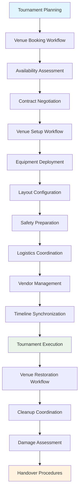

---
tags:
- process
- venue
- logistics
- facility
- coordination
- advanced-management
---

# Venue & Logistics Management Process

## Overview

The Venue & Logistics Management Process provides comprehensive frameworks for venue booking, setup,
configuration, and restoration workflows with advanced logistics coordination. This process enables
tournament organizers to manage complex facility requirements, coordinate multiple vendors, and ensure
optimal venue utilization throughout the tournament lifecycle.

## Purpose

This process addresses the sophisticated venue and logistics coordination requirements for professional
tournament execution, including facility booking, setup coordination, resource management, and
restoration procedures. It integrates with resource allocation, equipment distribution, and financial
planning processes to deliver seamless venue operations.

## Structure

This process includes standard attributes from the [Base Entity](../foundation/base_entity.md) and
encompasses four key workflow areas:

| Component | Type | Description |
|-----------|------|-------------|
| **Venue Booking Workflow** | Process Component | Availability checking, reservation management, contract negotiation |
| **Venue Setup Workflow** | Process Component | Equipment deployment, layout configuration, safety preparation |
| **Logistics Coordination Workflow** | Process Component | Resource scheduling, vendor management, timeline synchronization |
| **Venue Restoration Workflow** | Process Component | Cleanup coordination, damage assessment, handover procedures |
| **Integration Points** | Reference Collection | Connections to [Resource Allocation Process](../resource_allocation/README.md), [Equipment Distribution Process](../equipment_distribution/README.md), [Financial Reconciliation Process](../financial_reconciliation/README.md) |
| **Stakeholder Coordination** | Process Component | Venue managers, vendors, contractors, safety personnel |
| **Timeline Management** | Process Component | Setup schedules, coordination windows, restoration deadlines |
| **Quality Assurance** | Process Component | Setup validation, safety checks, restoration verification |

## Example

This example demonstrates the complete venue lifecycle from initial booking through final restoration.
The workflow begins with availability assessment and contract negotiation, progresses through
comprehensive setup including equipment deployment and safety preparation, coordinates complex
logistics during tournament execution, and concludes with systematic restoration and handover
procedures. This comprehensive approach ensures professional venue management that supports
successful tournament delivery while maintaining facility relationships and compliance standards.

## See Also

- [Resource Allocation Process](../resource_allocation/README.md) - Equipment and resource coordination
- [Equipment Distribution Process](../equipment_distribution/README.md) - Tournament equipment management
- [Safety Management Process](../risk_safety_management/README.md) - Venue safety and risk coordination
- [Financial Reconciliation Process](../financial_reconciliation/README.md) - Venue cost tracking and budget management
