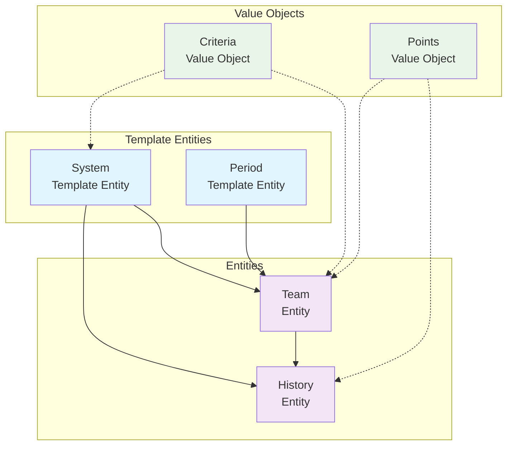

# Ranking Domain

## Overview

The Ranking Domain handles the pre-tournament ranking systems used for tournament seeding and initial team
placement. This domain provides comprehensive ranking calculation, period management, and historical tracking
capabilities that serve as the foundation for fair tournament seeding decisions.

The domain implements a sophisticated ranking system supporting multiple calculation methodologies, time-based
periods, detailed point breakdowns, and extensive historical analysis while maintaining clear separation from
in-tournament performance tracking (handled by the Standing Domain).

## Purpose

The primary purpose of the Ranking Domain is to provide a fair and accurate basis for tournament seeding by:

- Implementing configurable ranking calculation methodologies (ELO, points-based, performance-based)
- Managing time-based ranking periods with automatic updates and decay systems
- Maintaining comprehensive team ranking positions with detailed point breakdowns
- Tracking historical ranking changes and performance trends over time
- Supporting discipline-specific ranking criteria and qualification requirements
- Enabling cross-discipline ranking normalization and comparison
- Providing transparent and auditable ranking calculations for tournament seeding

## Domain Models

### Template Entities

Template entities define reusable configurations and methodologies for ranking systems.

#### [System](./system.md) | Template Entity

Defines ranking calculation methodologies, criteria configuration, and system-wide rules for different ranking
approaches. Supports ELO systems, points-based accumulation, performance-based calculations, and hybrid
methodologies with configurable parameters.

#### [Period](./period.md) | Template Entity

Manages time-based ranking cycles, update frequencies, and period-specific rules. Supports annual cycles,
rolling periods, seasonal updates, and tournament-based periods with automatic archival and decay systems.

### Entities

Entities represent concrete ranking instances and historical data with unique identities.

#### [Team](./team.md) | Entity

Concrete team ranking instances with current positions, detailed point breakdowns, historical tracking, and
qualification status. Links to specific ranking systems and periods while embedding detailed calculation
components.

#### [History](./history.md) | Entity

Historical ranking changes and performance trend analysis tracking position movements, peak performances, and
statistical summaries over time. Enables comprehensive reporting and methodology assessment.

### Value Objects

Value objects provide embedded calculation details and criteria parameters within ranking entities.

#### [Criteria](./criteria.md) | Value Object

Embedded calculation parameters, weighting factors, qualification requirements, and thresholds used within
ranking systems and team rankings to ensure consistent application of ranking rules.

#### [Points](./points.md) | Value Object

Detailed point calculation breakdowns including base points, bonus factors, penalty adjustments, and calculation
transparency embedded within team rankings for auditability and verification.

## Model Hierarchy

## Domain Integration

### Core Relationships

- **Tournament Domain**: Rankings provide seeding data for tournament creation and team placement
- **Team Domain**: Rankings track performance and qualification status for registered teams
- **Standing Domain**: In-tournament performance contributes to post-tournament ranking updates
- **Discipline Domain**: Discipline-specific rules and criteria influence ranking calculations

### Seeding Integration

The Ranking Domain serves as the primary data source for tournament seeding through:

- **Current Rankings**: Latest team positions and qualification status for immediate seeding
- **Historical Performance**: Trend analysis and peak performance data for seeding validation
- **Qualification Status**: Criteria compliance and eligibility verification for tournament entry
- **Cross-Discipline Normalization**: Standardized ranking comparison across different disciplines

## Domain Scope

### In Scope

- **Ranking Calculation**: Multiple methodologies with configurable parameters and validation
- **Period Management**: Time-based cycles, update scheduling, and automatic archival systems
- **Historical Tracking**: Comprehensive change tracking and performance trend analysis
- **Point Breakdown**: Detailed calculation transparency and auditable point attribution
- **Criteria Management**: Qualification requirements and calculation parameter configuration
- **Seeding Integration**: Tournament seeding data provision and qualification verification
- **Cross-Discipline Support**: Normalized ranking comparison and discipline-specific rules

### Out of Scope

- **In-Tournament Performance**: Real-time match results and stage-specific standings (Standing Domain)
- **Tournament Management**: Tournament creation, scheduling, and progression (Tournament Domain)
- **Team Registration**: Team creation, roster management, and registration (Team Domain)
- **Discipline Definition**: Sport rules, regulations, and discipline configuration (Discipline Domain)
- **Media Content**: Performance videos, photos, and promotional content (Media Domain)
- **Financial Tracking**: Prize money, fees, and financial transactions (Finance Domain)

## Business Rules

### Ranking Calculation Rules

- All ranking calculations must follow configured methodology parameters
- Point calculations must be transparent and auditable with detailed breakdowns
- Ranking updates must respect period-specific update frequencies and schedules
- Historical data must be preserved during ranking updates and period transitions

### Period Management Rules

- Each ranking period must have defined start/end dates and update frequencies
- Period transitions must preserve historical data and maintain ranking continuity
- Decay systems must be applied consistently according to period configuration
- Archive rules must be enforced to maintain system performance and data relevance

### Integration Compliance Rules

- Tournament seeding must use current ranking data from appropriate periods
- Team eligibility must be verified against current qualification criteria
- Cross-discipline rankings must follow normalization rules for fair comparison
- Historical analysis must respect data retention and privacy requirements

## Usage Patterns

### Tournament Seeding Workflow

1. **Retrieve Current Rankings**: Query team rankings for tournament discipline and period
2. **Verify Qualification**: Check team eligibility against ranking criteria requirements
3. **Apply Seeding Rules**: Use ranking positions and historical data for tournament seeding
4. **Generate Seeding Report**: Create transparent seeding documentation with ranking justification

### Ranking Update Workflow

1. **Collect Performance Data**: Gather tournament results and performance metrics
2. **Apply Calculation Rules**: Use ranking system methodology to calculate point changes
3. **Update Team Rankings**: Modify current rankings with new positions and point breakdowns
4. **Archive Historical Data**: Create ranking history entries for change tracking and analysis

### Cross-Discipline Analysis

1. **Normalize Ranking Data**: Apply cross-discipline normalization rules for comparison
2. **Analyze Performance Trends**: Use historical data for multi-discipline performance assessment
3. **Generate Comparative Reports**: Create analysis documentation for tournament planning
4. **Identify Qualification Patterns**: Analyze criteria compliance across disciplines for insights

## Related Documentation

- [Tournament Domain](../tournament/README.md) - For tournament seeding and management
- [Team Domain](../team/README.md) - For team information and registration  
- [Standing Domain](../standing/README.md) - For in-tournament performance tracking
- [Discipline Domain](../discipline/README.md) - For discipline-specific rules and regulations
- [Base Entity Documentation](../foundation/README.md) - For core entity patterns and attributes

## References

- [Domain-Driven Design: Tackling Complexity in the Heart of Software](https://www.amazon.com/Domain-Driven-Design-Tackling-Complexity-Software/dp/0321125215)
  by Eric Evans - Entity and Value Object patterns
- [ISO 8000-2:2017 - Data quality - Part 2: Vocabulary](https://www.iso.org/standard/36326.html) - Data quality
  standards for ranking systems
- [ELO Rating System](https://en.wikipedia.org/wiki/Elo_rating_system) - Mathematical ranking methodology reference
- [Event Management Body of Knowledge (EMBOK)](https://www.embok.org/index.php/embok-model) - Event ranking and seeding standards

## Model References

- [System](./system.md) - Ranking calculation methodology templates
- [Period](./period.md) - Time-based ranking cycle configuration
- [Team](./team.md) - Concrete team ranking instances
- [History](./history.md) - Historical ranking change tracking
- [Criteria](./criteria.md) - Embedded calculation parameters
- [Points](./points.md) - Detailed point calculation breakdowns
