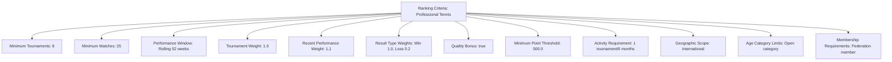
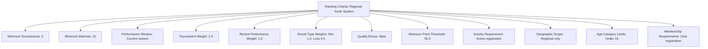

---
tags:
  - ranking-criteria
  - value-object
  - calculation-parameters
  - qualification-requirements
  - weighting-factors
  - tournament-management
---

# Ranking Criteria (Value Object)

## Overview

Ranking Criteria represents the embedded calculation parameters, qualification requirements, and
weighting factors used within Ranking Systems and Team Rankings. As a value object without
independent identity, it provides detailed configuration for ranking calculations, minimum
requirements, and performance thresholds for different competitive contexts.

## Purpose

This value object enables precise ranking configuration by:

- Defining minimum participation and performance requirements for ranking eligibility
- Configuring weighting factors for different performance aspects and time periods
- Establishing qualification thresholds for tournament entry and competitive advancement
- Supporting flexible calculation parameters for diverse ranking methodologies
- Providing embedded configuration that travels with ranking entities

## Structure

This value object includes the following ranking criteria-specific attributes:

| Attribute | Description | Type | Required | Notes / Example |
|-----------|-------------|------|----------|-----------------|
| **Minimum Tournaments** | Required number of tournaments for ranking eligibility | Integer | Optional | `5`, `10`, `3` (minimum participation) |
| **Minimum Matches** | Required number of individual matches for qualification | Integer | Optional | `15`, `25`, `8` (match-based requirements) |
| **Performance Window** | Time period considered for ranking calculation | String | Yes | `"12 months"`, `"Current season"`, `"Rolling 18 months"` |
| **Tournament Weight** | Weighting factor for tournament performance | Decimal | Optional | `1.0` (standard), `1.5` (premium), `0.8` (reduced) |
| **Recent Performance Weight** | Additional weight for recent vs historical results | Decimal | Optional | `1.2`, `1.0`, `0.9` (recency bias) |
| **Result Type Weights** | Weighting for different match outcomes | String | Optional | `"Win: 1.0, Loss: 0.1, Walkover: 0.5"` |
| **Quality Bonus** | Additional points for high-quality opponent victories | Boolean | Optional | `true` (quality bonus applied), `false` (no bonus) |
| **Minimum Point Threshold** | Minimum points required for ranking inclusion | Decimal | Optional | `100.0`, `500.0`, `50.0` |
| **Activity Requirement** | Required competitive activity for ranking maintenance | String | Optional | `"1 tournament per 6 months"`, `"Active membership"` |
| **Geographic Scope** | Geographic limitations for ranking eligibility | String | Optional | `"Regional only"`, `"National"`, `"International"` |
| **Age Category Limits** | Age-based restrictions for ranking participation | String | Optional | `"Under 18"`, `"Senior 35+"`, `"Open category"` |
| **Membership Requirements** | Organizational membership needed for ranking | String | Optional | `"Federation member"`, `"Club registration"`, `"None"` |

## Example

### Example: Professional Tournament Criteria

This example demonstrates professional tennis ranking criteria requiring eight tournaments and
25 matches minimum over a rolling 52-week period. Recent performance receives 10% bonus weighting,
quality bonuses apply for strong opponent victories, and minimum 500 points are required for
ranking inclusion. This covers all Ranking Criteria attributes for professional competitive
requirements including geographic scope, activity requirements, and membership qualifications.

### Example: Youth Development Criteria

This second example shows youth development criteria with lower requirements appropriate for
developing players. Only three tournaments and 10 matches are required within the current season,
with no quality bonuses but higher loss point retention to encourage participation. Regional
scope and club registration requirements support local development programs.

## See Also

- [Ranking System](system.md) - Template entities using ranking criteria
- [Team Ranking](team.md) - Entities embedding ranking criteria compliance
- [Ranking Points](points.md) - Related value object for point calculations
- [Tournament](../tournament/tournament.md) - Tournament participation affecting criteria
- [Team](../team/team.md) - Teams subject to ranking criteria requirements
